# 스크럼

## 1. 오늘의 주요 일정 (Events/Schedule)
- 컨트롤러
- 스케줄링과 오토스케일링

## 2. 오늘 완수할 일 (Tasks)
- Controller
- Controller - ReplicaSet
- Controller - Deployment
- Controller - StatefulSet
- Job / CronJob
- Node Scheduling
- AutoScaler - HPA
- AutoScaler - VPA
- AutoScaler - CA
- API 안 한 것 목록 작성

## 3. 이슈 및 질문 (Blockers / R&D)
- 없음

# 새로 배운 내용

## controller
- 
- 
- stateless application
    - 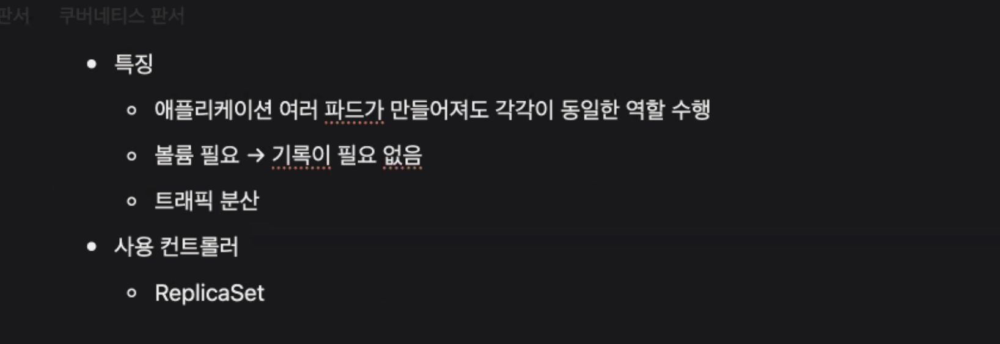
- stateful application
    - 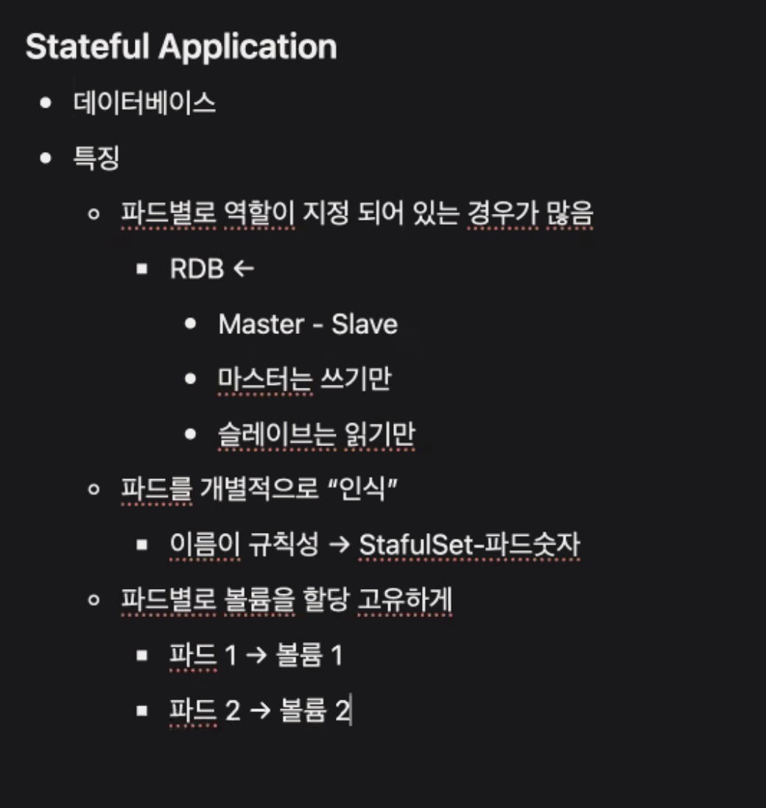
    - pod가 삭제 되어도 볼륨은 삭제 되지 않니다.
    - 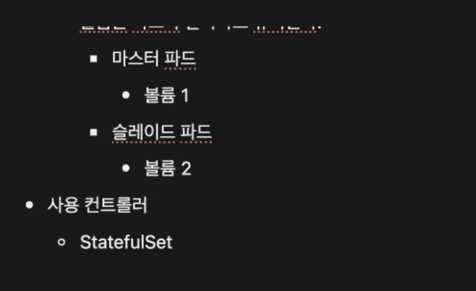
## ReplicaSet contoller
- 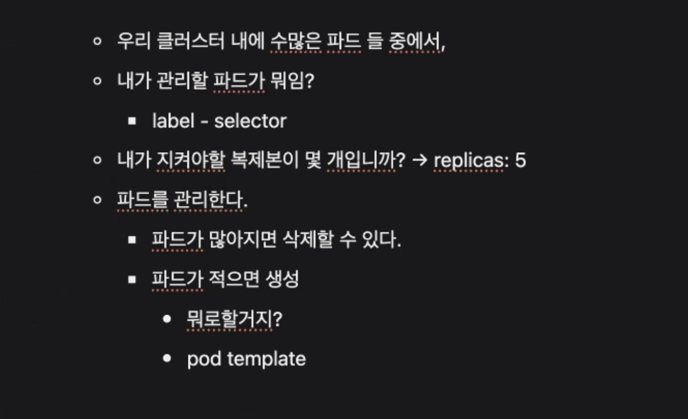
- 실무에서는 replicaset을 실제로 사용하지 않는다.
- 실무에서의 사용
    - 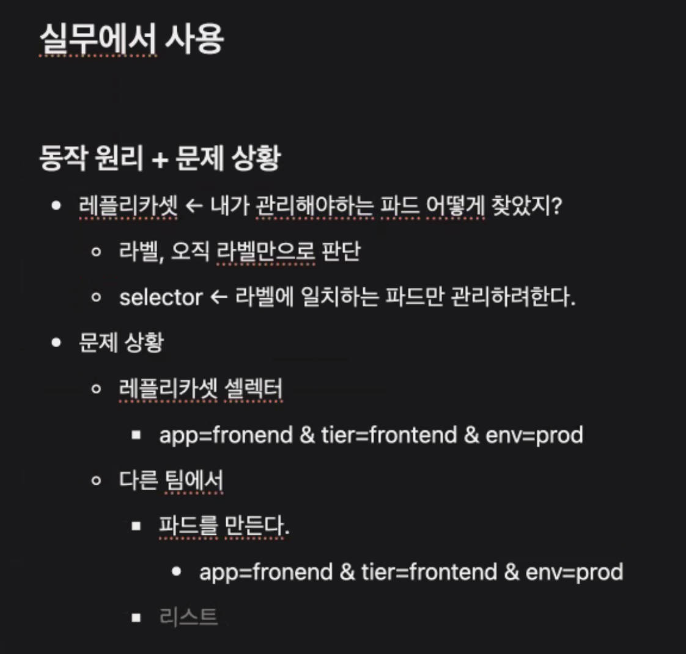
    - 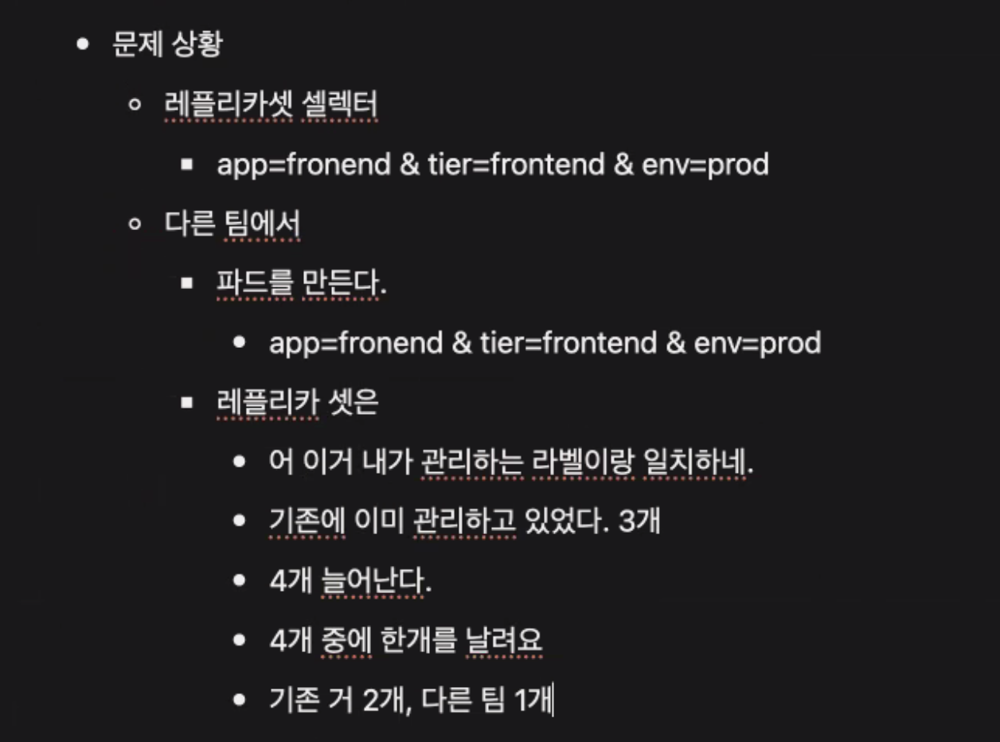
    - application 잘 돌아가고, 버그도 없는데 다른 팀과 라벨이 동일하면 해당 컨트롤러가 이것도 관리하려 한다. 이때 기존에 pod 3개를 관리했고, 개수 제한을 3개로 했다면 하나를 삭제하게 되는데 새로운 pod를 삭제 안 할 수도 있음. 이를 adoption이라고 합니다.
- 해결 방법
    - 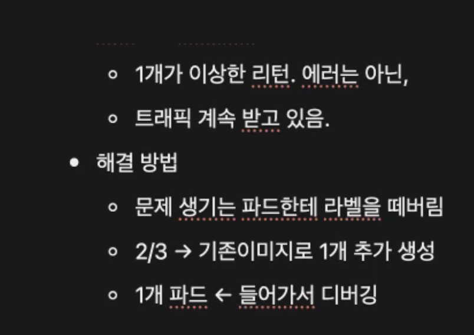
- ReplicaSet이 프로세스가 살아있는지도 확인하는데 프로브는 필요할까?
    - 일반적으로 필요하다.
    - ReplicaSet은 프로세스가 진짜 '살아있는지'만 확인한다.
    - Liveness probe는 정상적인 응답을 주는지도 확인합니다.(readiness probe는 살아있는지만 확인함)
## Deployment
- 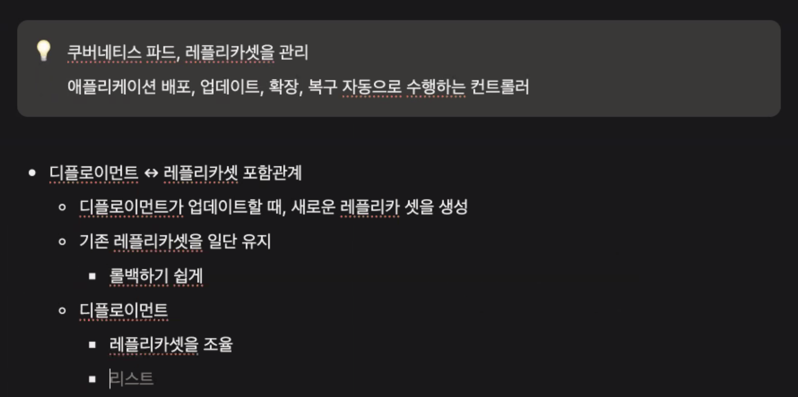
    - 레플리카셋 수명 주기 제어
- Recreate
    - 잘 사용하지는 않음. 중단이 될 수 있으므로 테스트 환경 배포할 때 사용함.
    - 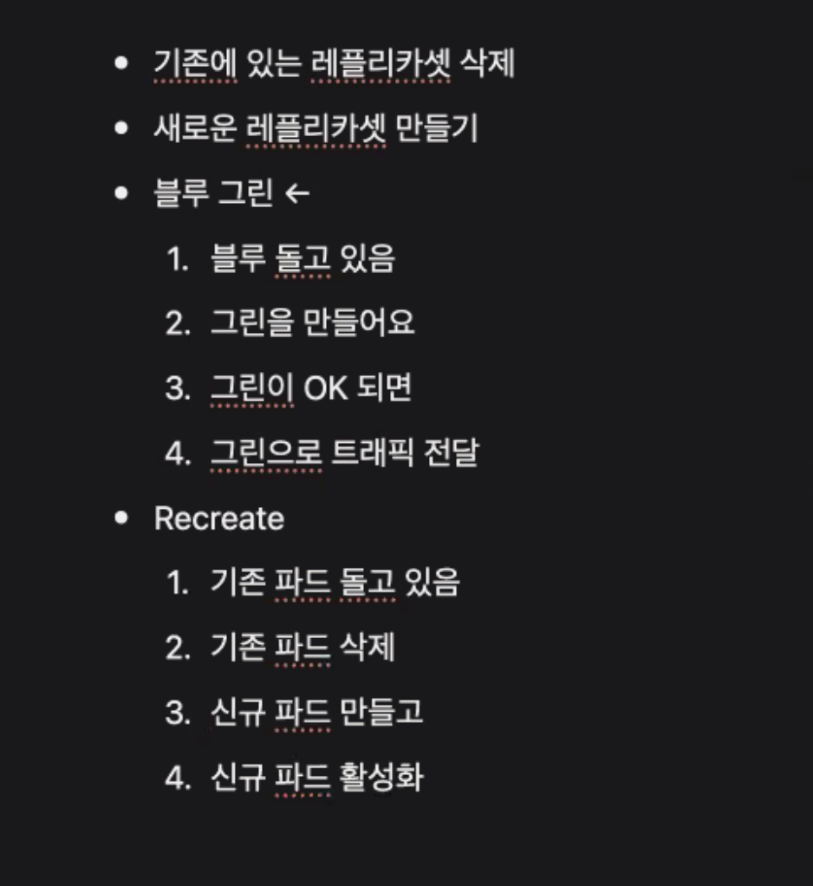
    - 활용예시
        - 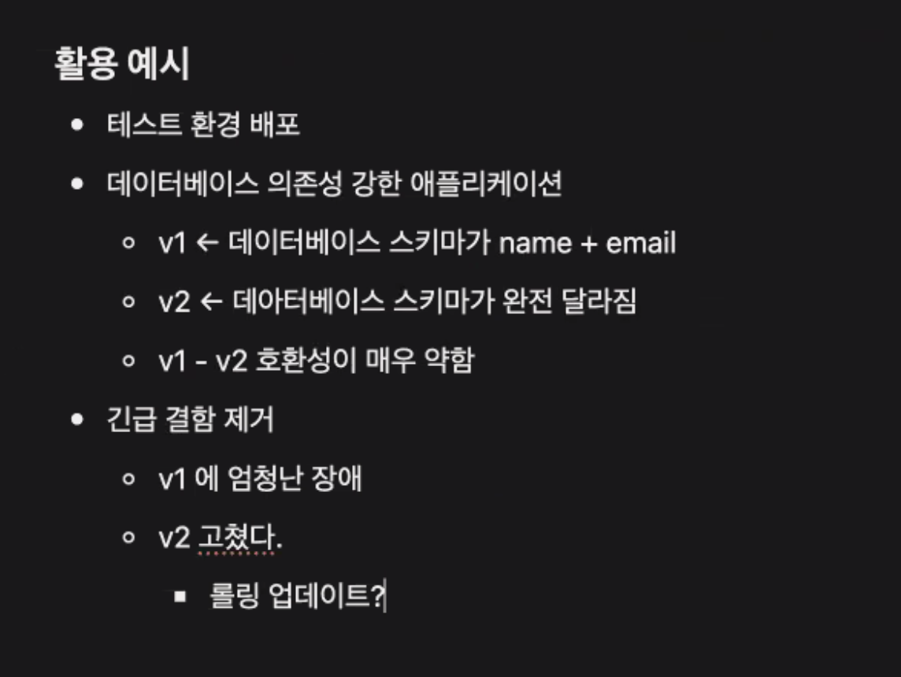
        - 문제 있는 것만 다 내리고, 새롭게 올린다.
        - 긴급 배포 때는 롤링으로 전부 내리는 것은 안 됨. 인스턴스 1000개라면? 다 내리고 올려야 함.
- Rolling
    - 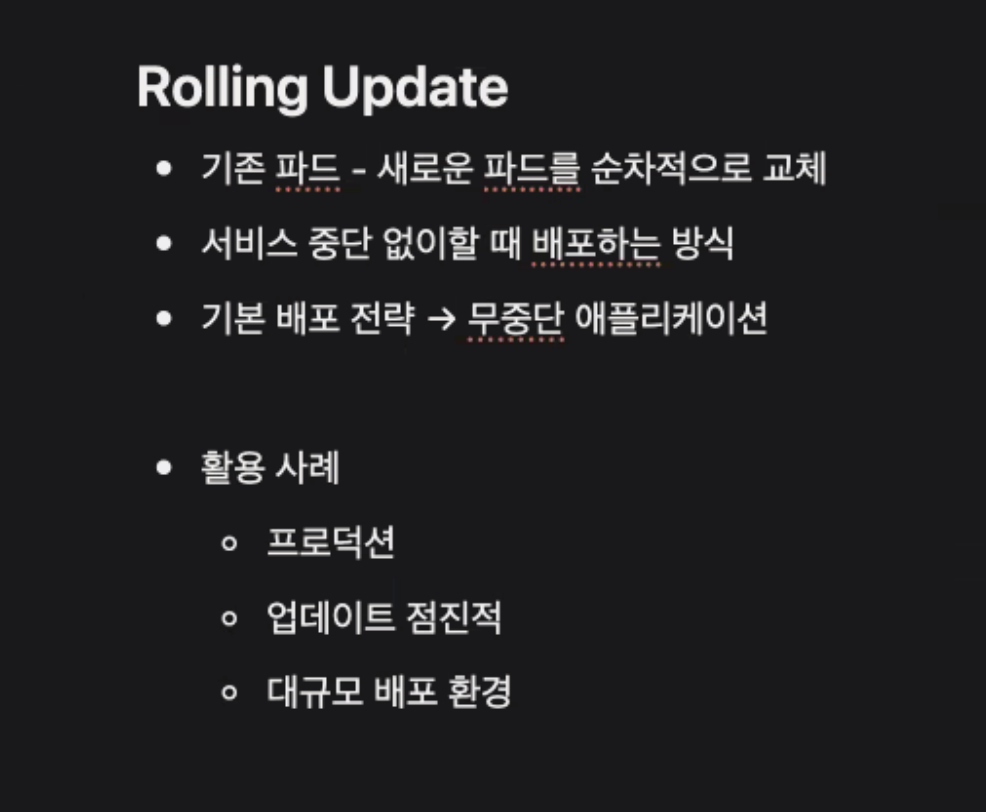
    - 무중단 배포 서비스일 때 사용함.
- 사용 이유
    - 컨테이너가 너무 많은데 이를 다루기 어렵기 때문에 k8s가 나옴. 그럼  배포도 당연히 어려움. 이를 해결하기 위해!
    - 배포, 업데이트, 자동화, 복구
- 실무 배포 방식
    - 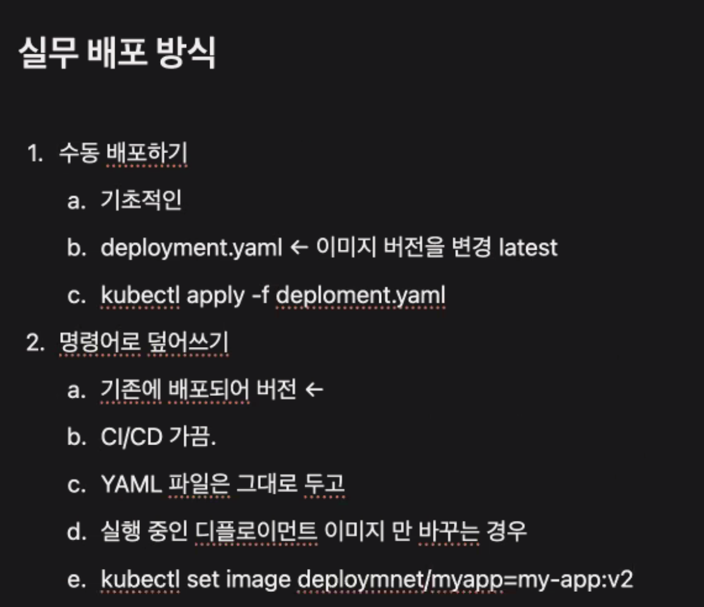
    - 템플릿 엔진이 실무 표준이다.
- 실무 팁
    - deployment 일시정지를 할줄 알아야 한다.
- rolling update를 한다면 probe와 연동을 잘 해야 한다.
    - readiness probe와 연동을 잘해야 한다. v2 배포한 다음 부팅 성공만 보고 v1을 전부 꺼버릴 수도 있다. v2는 아직 부팅도 안 되었는데 이렇게 되면 켜지는 동안  500 응답만 받는다.
    - 또 특정 probe로 응답을 받지 않으니 이를 죽이고 다시 켤 수도 있으니 무한의 500 굴레에 빠질 수도 있다.

## StatefulSet
- 쿠버네티스가 상태를 가진 애플리케이션 배포, 관리하는 컨트롤러입니다.
- 
    - 상태를 기억해야 할 때 사용합다다.
    - 네트워크 아이디를 통해 누가 어떤 것을 하는지 알도록 한다.
- 영구 스토리지
    - 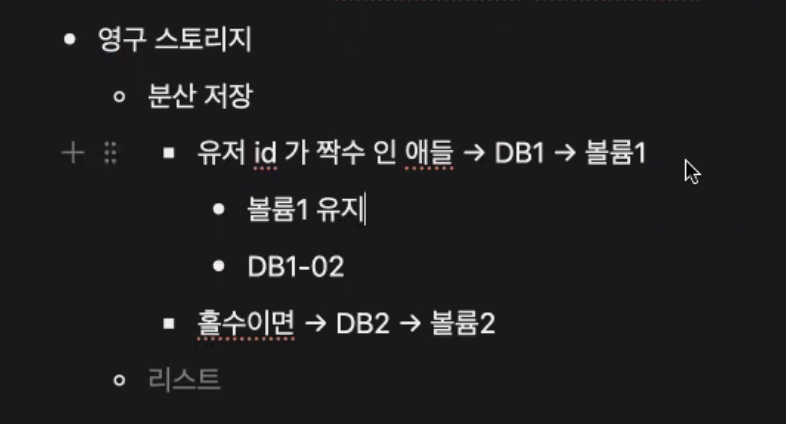
- 파드 생성 시 순서를 중요 시
    - master, slave DB가 있을 때 slave부터 생기면 에러가 발생한다. 보통 slave가 생성 되고 master와의 연결을 요청하기 때문이다.
- 실무
    - statefulSet을 잘 사용하지 않는다.
    - 쿠버네티스가 하고 싶은 게 아님
    - 왜 디비를 쿠버네티스에 잘 올리지 않나요?
        - 잘 뜨고, 잘 죽는 서비스들을 관리하는 것이 목적임. -> WAS, WS
        - 파드, 컨테이너 죽으면 데이터 날아감
        - DB는 죽으면 데이터가 날아간다.
        - 볼륨 PVC 무조건 설정
        - 파드 무조건 죽으면 안 된다.
- 운영 오버헤드
    - 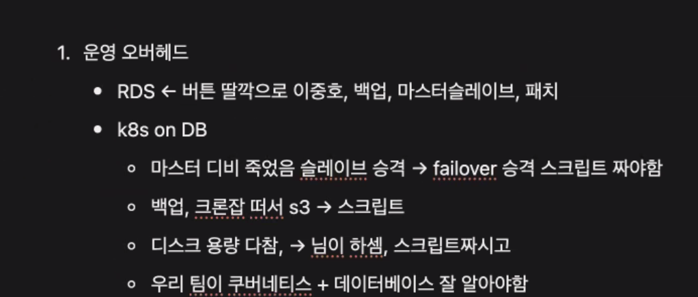
    - RDS는 이중화, 백업, 마스터슬레이브, 패치가 가능
    - k8s on DB
        - 마스터 디비 죽으면 슬레이브 승격 -> failover 스크립트 필요
        - 백업, 크론잡 떠서 s3 스크립트
        - 디스크 용량 다찬 것에 대해 스크립트 작성
        - 우리 팀이 쿠버네ㅌ티스 + DB 둘다 잘해야 함.
-  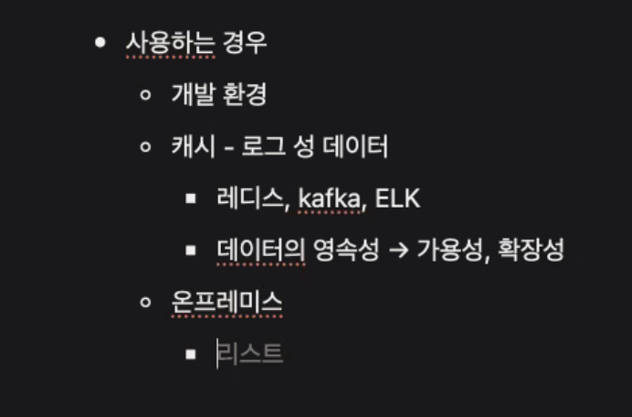

## Job
- controller와 같은 것
- 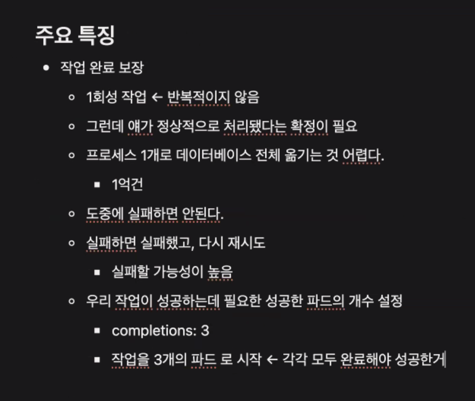
- 병렬 처리가 지원된다.
    - 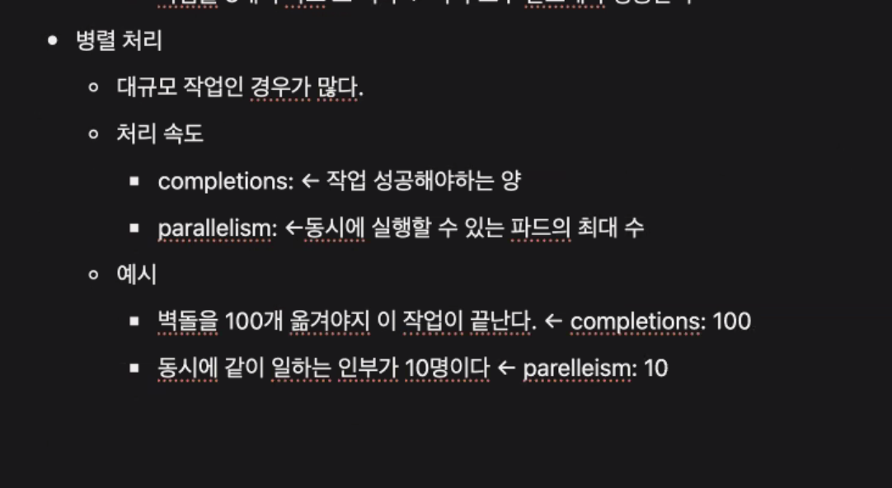
    - 대규모 작업인 경우가 많다.
    - 처리 속도
    - 파드 자동 종료

## Cron Job
- 반복적으로 처리함. 스케줄링 되어 있다.
- 일반적으로 Job 보다 많이 일어난다.
- 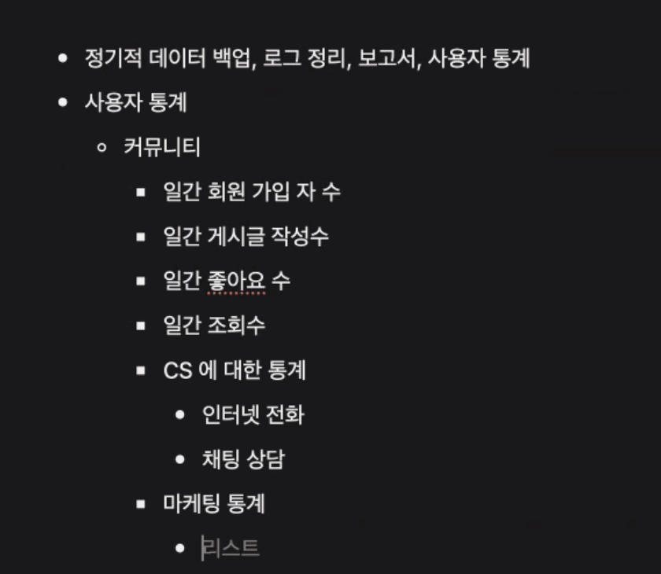
- 주요 특징
    - 정기적으로 특정 작업 수행
    - 자동으로 잡을 생성 및 실행
    - 실행 주체는 내가 아니라 시간 자체
    - 작업 내역을 남겨야 함. 관리자는 이미 실행되고 이후에 알게 됨
- 성공/실패 기록에 대해 리소스를 완전히 종료하 않고 갖고 있다ㅣ 그래서 만약 많이 돌아간다면 이를 꼭 제한해둬야 한다.

## Job과 Cron Job 판서 설명
- 추가 설명
    - 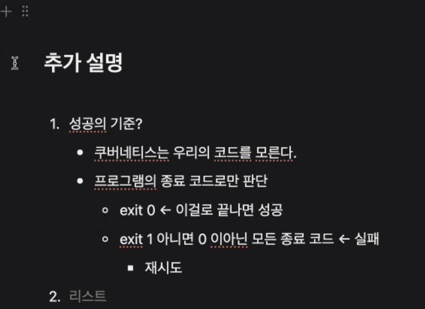
    - 성공의 기준
        - 성공의 기준을 쿠버네티스는 모른다. status code 등을 설정해둬야 한다.
- 실무 활용
    - job 보다는 cron job을 많이 사용하게 됨
    - 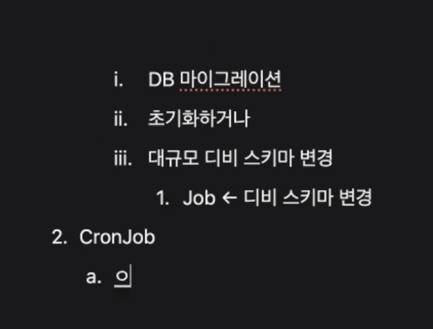
    - 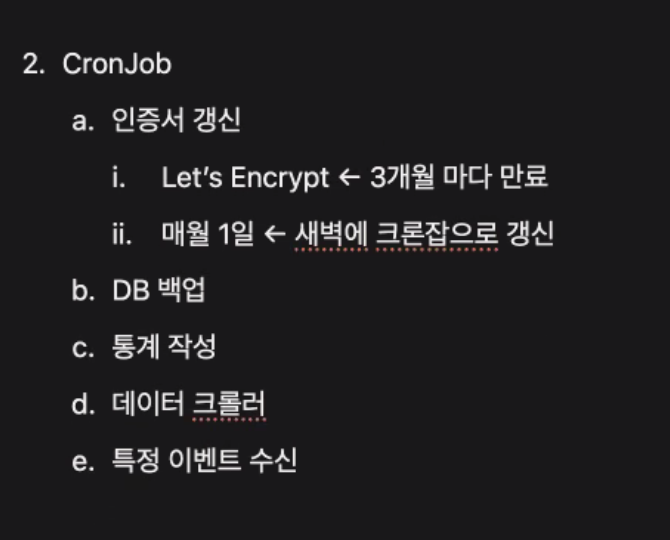
- 유의 사항
    - 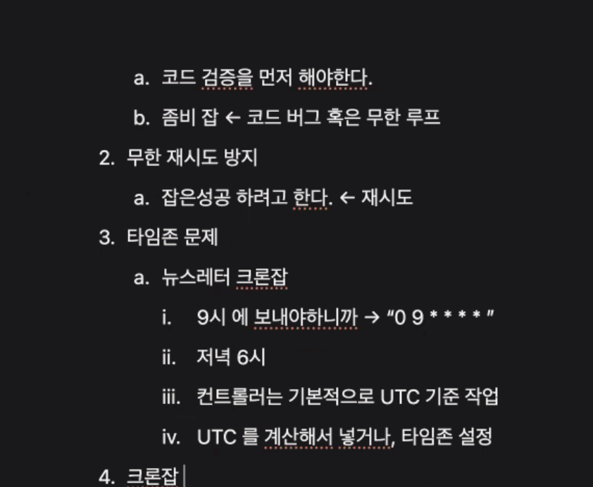
    - 로컬에서 먼저 돌려서 버그 잡기
    - 무한 재시도 방지
    - 타임존 문제
    - 크론잡 중복 실행
        - 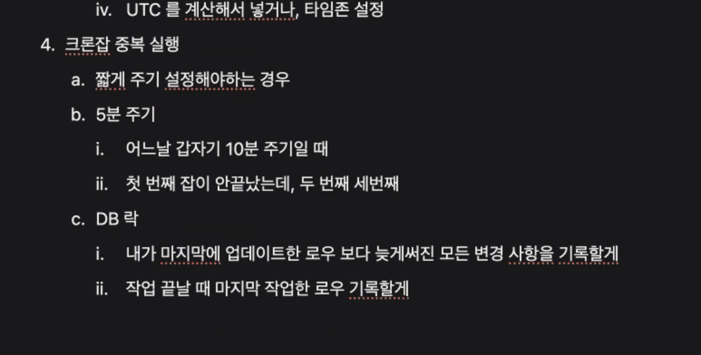
        - 실무에서는 보통 크론잡의 동시 실행과 replace를 막는다.
    - 기록을 청소해야 한다.
        - Completed라는 상태로 파드를 남겨둔다.
        - 파드 리스트 
        - 주기가 짧은 크론잡이라면 따로 지워주거나 제한을 걸어두지 않을 때 며칠 안 보기만 해도 수 천개가 쌓여있는다.
        - completed이므로 메모리는 먹지 않지만 디스크는 잡아먹는다. 때문에 이상하게 디스크가 부족하다면 이것이 문제일 수도 있다.

## Node scheduling
- 해당 파드는 자원을 얼마만큼을 먹어요를 미리 작성해둠
- 기본 스케줄링
- NodeName
    - 잘 사용하지 않음
    - 일반 사용자들이 사용하는 서비스가 아닌 백오피스 서비스는 NodeName 등을 사용할 수도 있다. 그렇다면 스케줄러를 거치지 않습니다.
- NodeSelector
    - 잘 사용하지 않음
    - 특정 라벨을 갖고 있는 노드에만 적용. 아주 간단하게 key value 형식으로만 이뤄짐. affinity가 더 복잡한 설정을 둘 있음
- NodeAffinity(Affinity: 유연, 유연성)
    - 실무에서 많이 사용됨
    - NodeSelector와 다르게 필수, 선호 조건을 줘서 더 복잡하게 설정할 수 있다.
    - 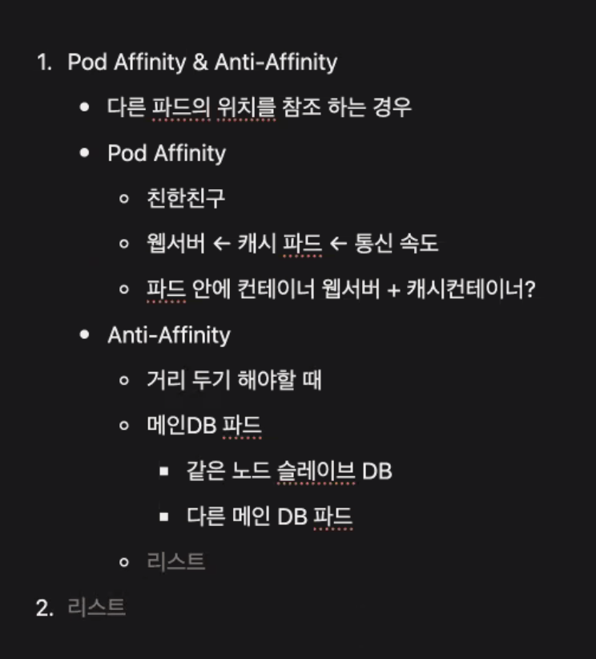
    - 테인트 어피니티
        - 출입 금지를 시킬 수 있음
        - 특수 목적 노드 
## Auto scaler HPA
- 수평으로 확장하는 오토 스케일러
- deployment와 HPA가 짝꿍인 경우가 많다.
- pod 증설 기준을 단순 CPU 사용률로 하면 안 됨. 스프링 같은 경우 로드 되는데 오래 걸린다. 메모리를 잡고 있어도 실질적으ㅇ로 서버는 돌아가지 않는다.
- minReplicas와 maxReplicas를 꼭 설정해둬야 함.
- 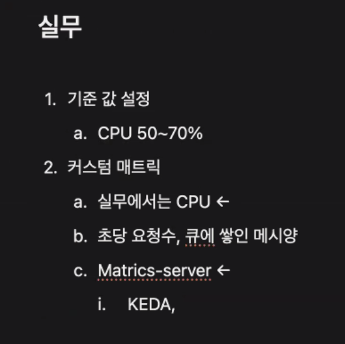
- 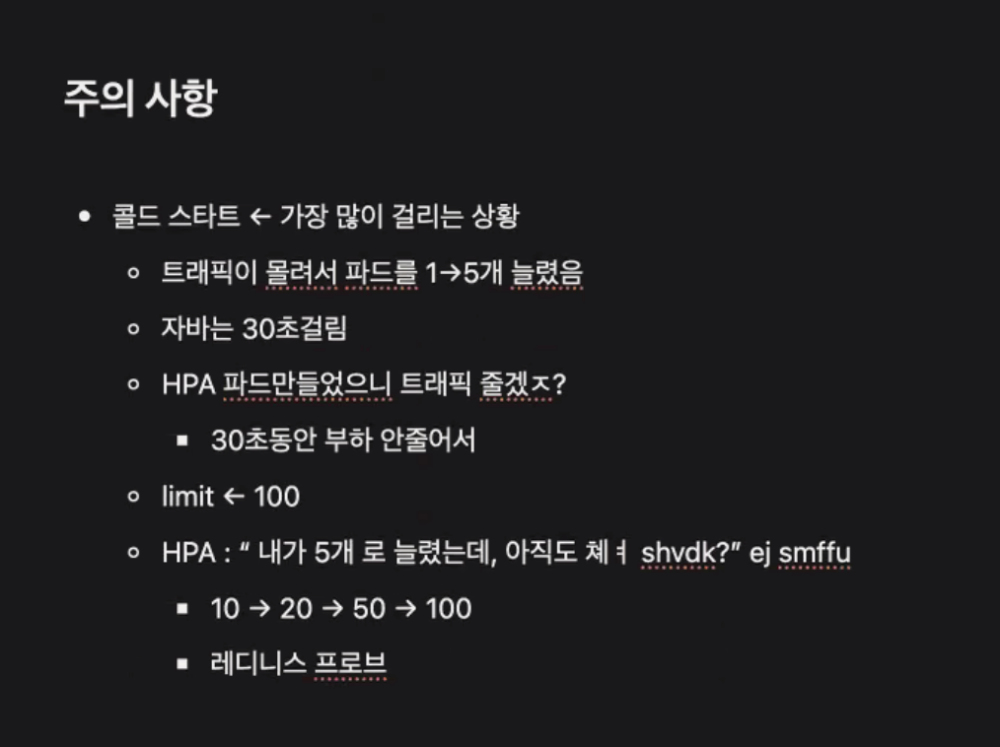
- 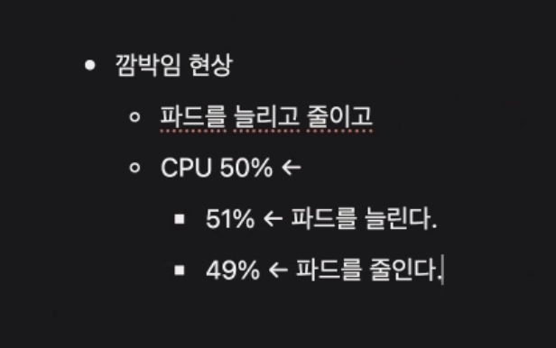

## VPA
- 데이터베이스 RDBMS는 인스턴스를 늘리기 어렵다.
    - 데이터 동기화 때문에
- 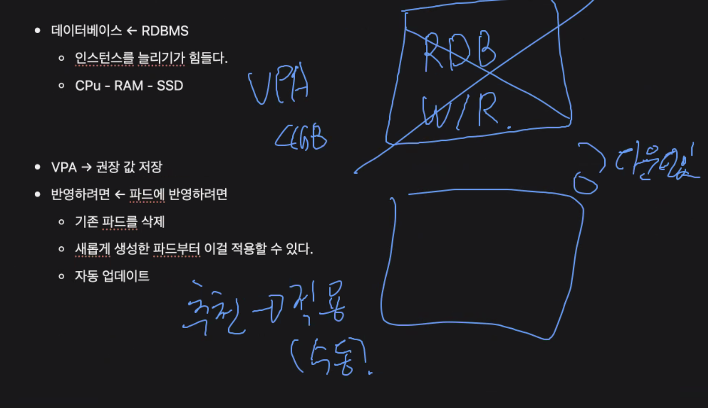
- 보통 기존 pod를 삭제해야 하므로 자동으로 하지는 않는다. 수동으로 추천한다.
- 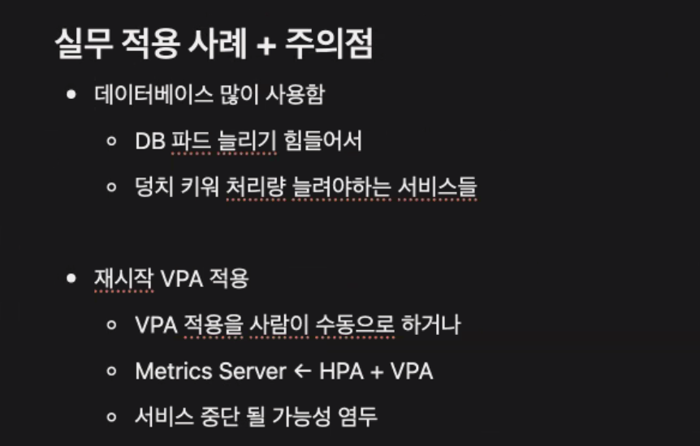
    - 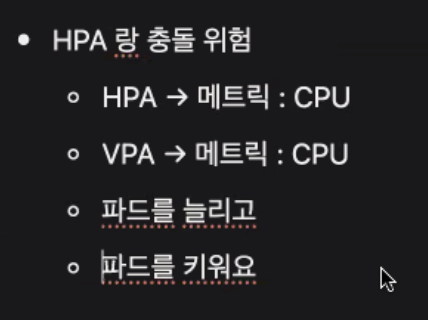
- HPA + VPA
    - 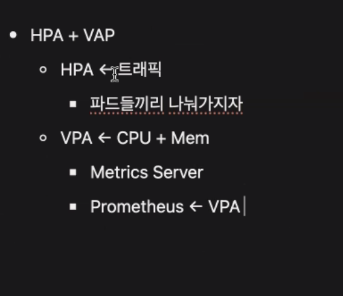
    - HPA와 VPA가 같은 곳만 바라보지 않으면 된다.
        - 바라 보몀ㄴ 무슨 문제가?

## CA(Cluster AutoScaler)
- 주의 사항
    - 비용 주의! 클라우드에서 한다? 최대 노드 개수 설정 잘 해두기!
    - 노드 콜드 스타트
        - EC2 켤 때 시간 오래 걸림
- ca는 실습 필수가 아님

## hpa, vpa, ca 정리
- 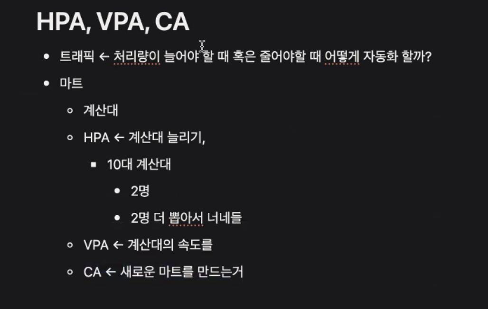
- hpa는 파드를 증설함
- vpa는 기능만 늘림
- ca는 노드 자체를 만들어 버림

# 오늘의 도전 과제와 해결 방법

- 도전 과제 1: 도전 과제에 대한 설명 및 해결 방법

# 오늘의 회고

- 성공적인 점, 개선해야 할 점, 새롭게 시도하고 싶은 방법 등을 포함할 수 있습니다.

# 참고 자료 및 링크

- [링크 제목](URL)

