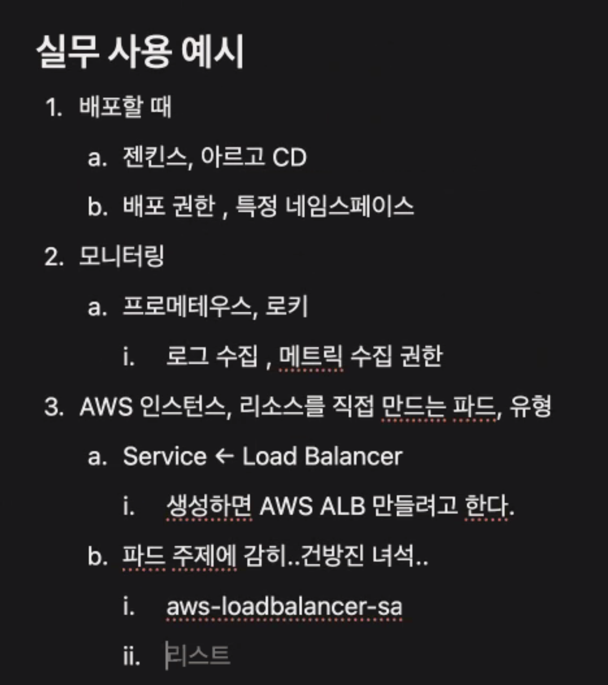
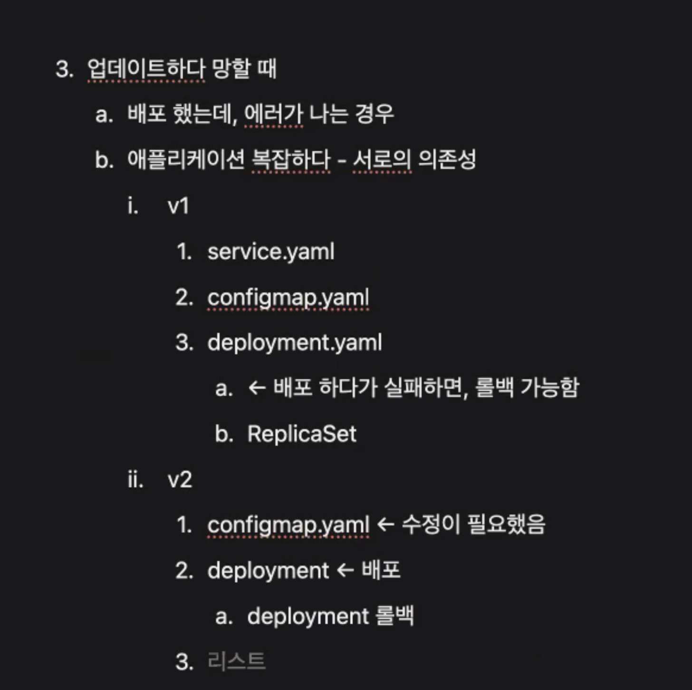
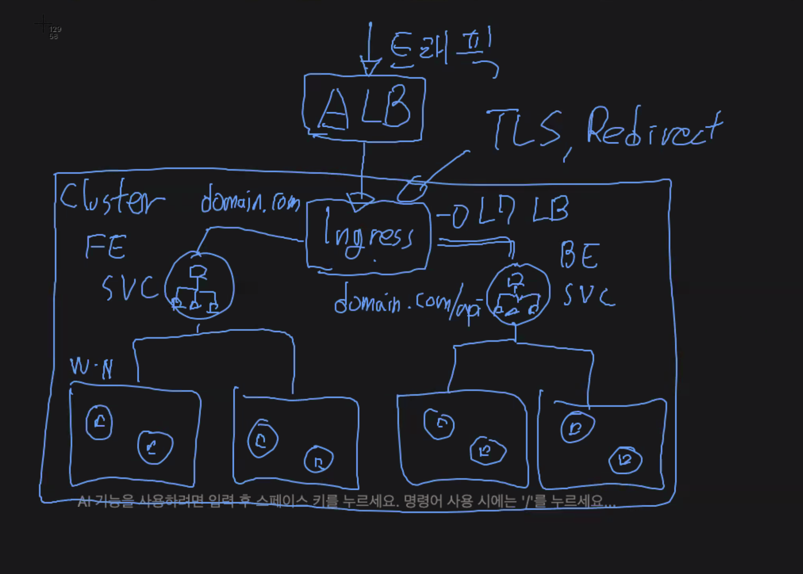
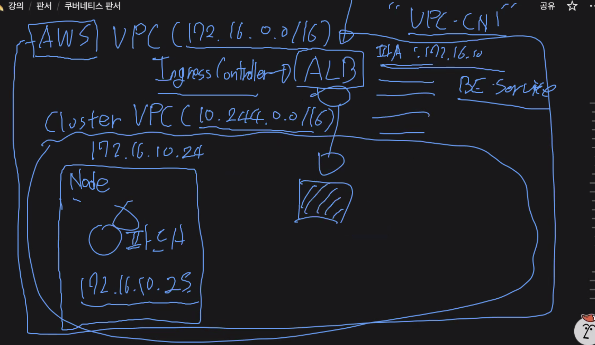

# 스크럼

## 1. 오늘의 주요 일정 (Events/Schedule)
- 보안과 접근 관리
- 실무 적용

## 2. 오늘 완수할 일 (Tasks)
- Job / CronJob
- Node Scheduling
- AutoScaler - HPA
- AutoScaler - VPA
- AutoScaler - CA
- RBAC (Role-Based Access Control)
- Service Account
- Helm
- Prometheus
- Grafana
- Loki
- Ingress
- ArgoCD

## 3. 이슈 및 질문 (Blockers / R&D)
- rolling update로 Terminating 상태가 된 pod는 kubectl delete -f 파일로 해도 삭제되 되지 않는다.
    - 자동으로 삭제하는 방법? 보통 Cron Job으로 이런 것도 하는 건가? 아니면 별도의 스케줄링 프로그램을 돌리는 건가?

# 새로 배운 내용

## Service Account
- 
- 부하 테스트 시 하나의 인스턴스에 PLG 스택(Prometheus, Loki, Grafana) 추가해라. 보기 편하다.
    - 프로메테우스, 그라파나 추가하면 편하다.
    - 로키까지는 어려울 수는 있어도 마무리 하면 꼭 두 개는 설치하는 것을 추천한다.
## Helm
- 쿠버네티스 리소스를 패키지처럼 만듭니다.
- 

## Helm과 kustomize 실무에서의 선택
```
둘은 vs 라기보다는 보완재 성격이 강함
헬름 쓰면 좋을 때
남에게 배포해줄 때
우리가 만든 솔루션을 다른 고객사에게 납품하거나
우리가 만든 솔루션을 회사 내에서 다른 팀이 사용해야 할 때
이럴 댄 헬름 차트로 포장해서 보내는게 좋음
복잡한 애플리케이션 사용해야 할 때
설정해야할 게 많은 애플리케이션을 사용해야 할 때
레디스, 프로메테우스, 젠킨스 등등..
설정해야 할 값을 이미 만들어진 헬름 차트로 사용할 수 있음
커스터마이즈 써야할 때
“우리 팀 내부 서비스 관리”
우리 팀이 직접 개발하는 백엔드 서버에서
deployment.yaml 은 그대로 유지하면서
환경변수만 살짝 바꿀때는 커스터마이즈가 깔끔하고 덜 복잡함
```

## Ingress
- 
- 

# 오늘의 도전 과제와 해결 방법

- 도전 과제 1: 도전 과제에 대한 설명 및 해결 방법

# 오늘의 회고

- 성공적인 점, 개선해야 할 점, 새롭게 시도하고 싶은 방법 등을 포함할 수 있습니다.

# 참고 자료 및 링크

- [링크 제목](URL)
