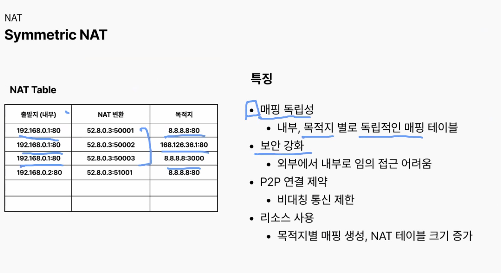
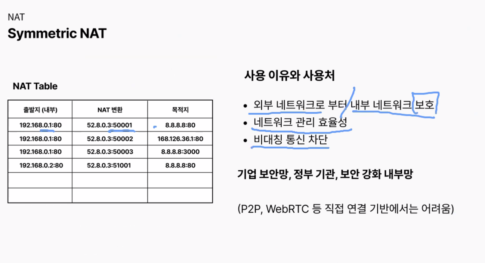
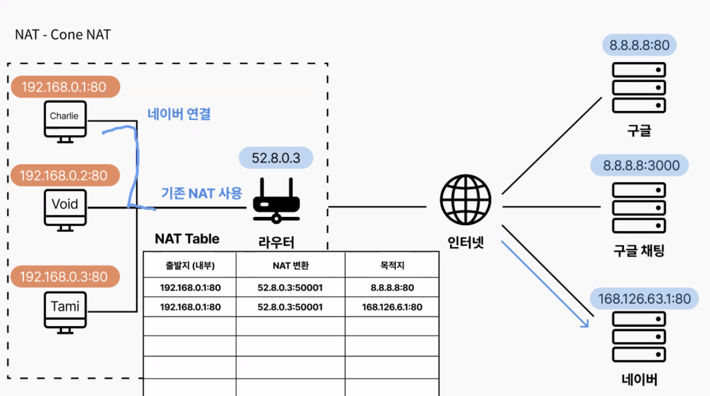

## 스크럼

### 오늘 배울 내용

- 없음

### 복습 및 추가 학습

- 없음

### 과제

- 없음

## 새로 배운 내용

### 주제 1: NAT

- 
    - 포트로 내부 망 사설IP를 구분하는 테이블을 갖고 있다.
    - 할당한 포트는 특정 시간 동안 유지하다가 끝나면 할당 해제한다.
- 
    - Symmetric NAT는 출발지가 같아도 목적지가 다르면 NAT 변환을 계속 진행한다.
- 
    - 같은 호스트가 보내도 매번 다른 URI로 소통을 하니 보안이 중요한 곳에서 사용하는 NAT 방식
- 
    - 호스트가 같다면 목적지가 달라도 항상 같은 포트로 통신하게 됨.
    - 포트가 고정 되어 있으니 URI만 알면 누구든지 해당 호스트와 통신 가능함.
    - 누구에게 허용하냐에 따라 Full, Restricted, Port Restricted 세 가지 방법이 있음
- 
    - 모두에게 허용
- Restricted Cone NAT
    - 특정 IP를 가진 호스트만 가능
    - 
- 
- Symmetric NAT vs Port Restricted NAT 차이
    시매트릭 NAT:
    내부 IP + Port 가 같다 하더라도 목적지가 다르면 계속 NAT 변환 새롭게 함.

    Cone NAT:
    내부 Ip + Port 가 동일하면, 목적지가 달라도 동일한 NAT 변환 값을 재사용함

    Port Restricted Cone NAT :
    내부 IP + Port 가 동일하면, 기존에 만들어진 NAT 변환 값을 사용함.
    새로운 목적지로 가야할 때, NAT 변환 값을 새롭게 만드는게 아닌, 허용 목적지를 추가함.

### Port forwarding
- NAT의 일종, 개념적으로는 NAT가 더 큰 개념이지만, 기능적으로는 NAT는 내부 -> 외부의 트래픽을 다룹니다
- NAT: 내부 -> 외부(인바운드)
- Port forwarding: 외부 -> 내부(아웃바운드)

## 오늘의 도전 과제와 해결 방법

- 도전 과제 1: 도전 과제에 대한 설명 및 해결 방법

## 오늘의 회고

- 성공적인 점, 개선해야 할 점, 새롭게 시도하고 싶은 방법 등을 포함할 수 있습니다.

## 참고 자료 및 링크

- [링크 제목](URL)
