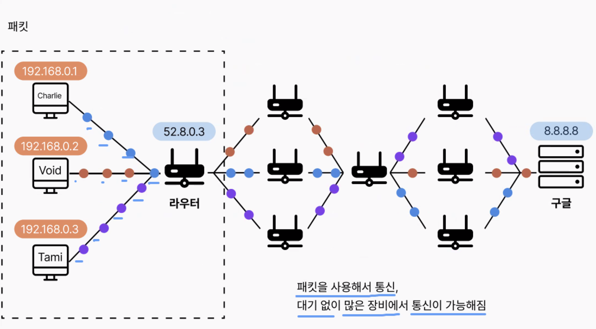
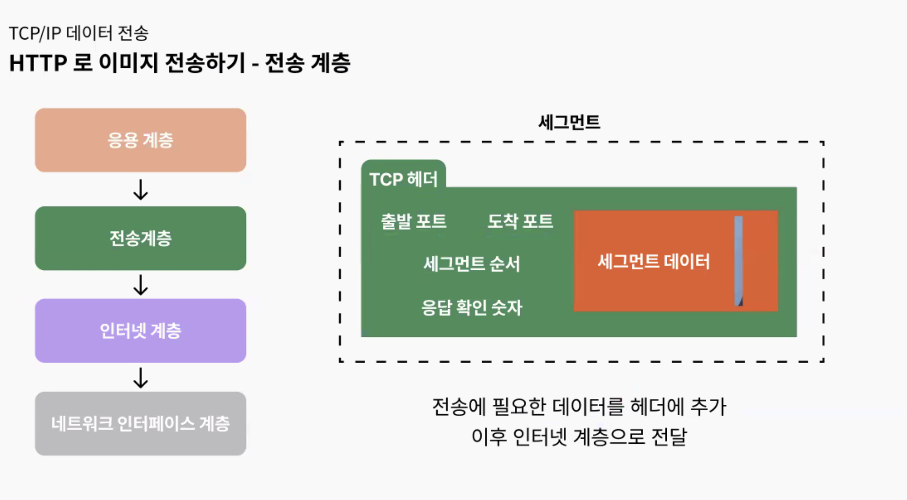
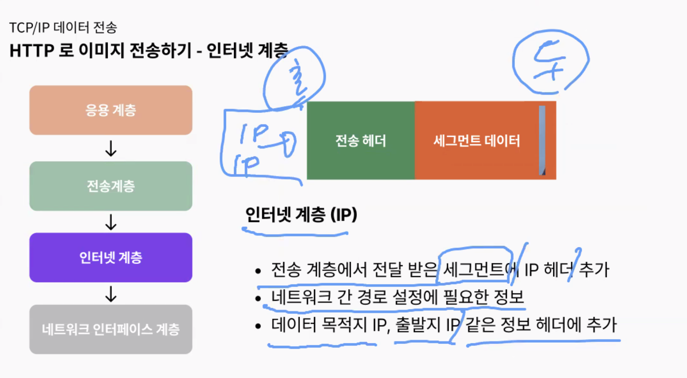
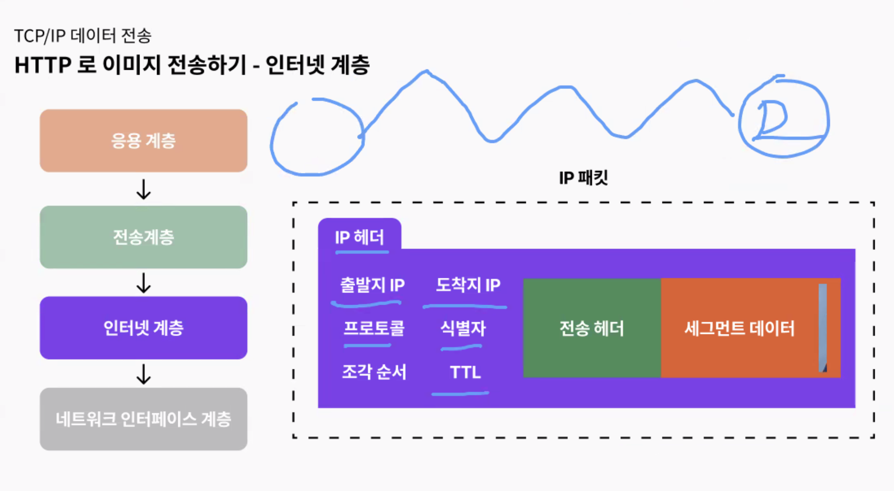
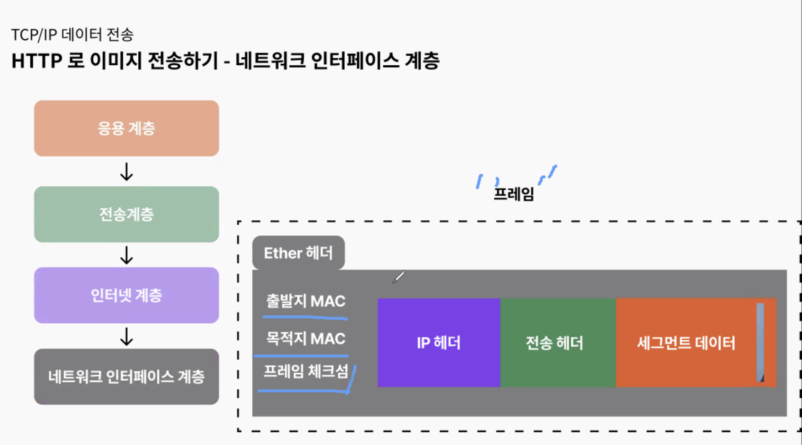
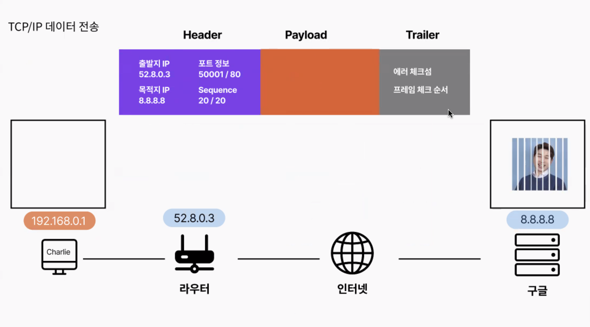
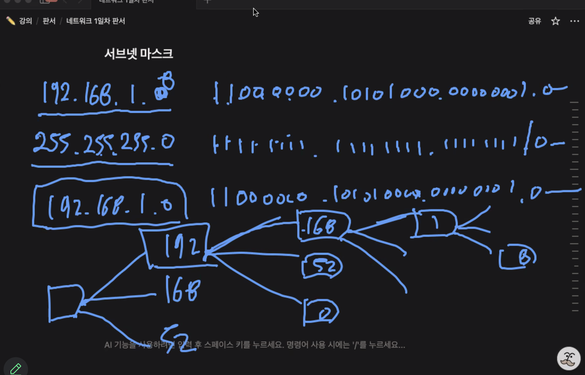
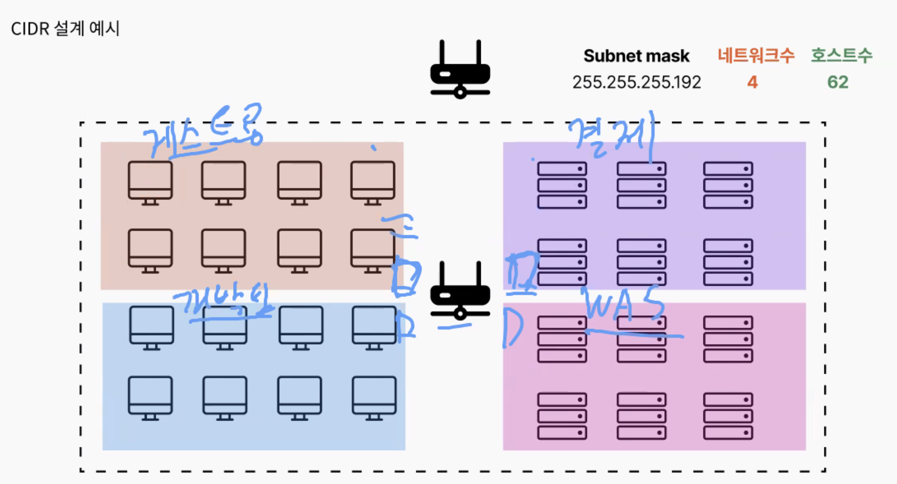

## 스크럼
### 오늘 배울 내용
- 네트워크의 흐름
- CIDR
- 서브넷

### 복습 또는 심화학습
- 없음

### 과제
- BE 개발
    - 게시글 목록 조회
    - 게시글 CUD
    - 댓글 CUD

## 새로 배운 내용

### 주제 1: 주제에 대한 설명

- 네트워크에서 스트림 형태로 쭉 보내면 다른 호스트는 보낼 수 없고, 대기해야 한다.
    - 
- 
- 
- 
- 
- 
- 
- 
    - 브로드캐스트 막기
    - 보안으로 막을 수 있음(권한 분리)

## 오늘의 도전 과제와 해결 방법

### 미니 퀘스트 1
<aside>
👉 다음 CIDR 주소에 대해 각각의 서브넷 마스크, 호스트 수, IP 주소 범위를 계산하고 설명을 작성하세요.

1. **192.168.0.0/16**
2. **172.10.10.0/24**
3. **10.3.0.0/24**

각 계산 항목에 대한 정답은 다음 정보를 포함해야합니다.

- **서브넷 마스크**: 네트워크 비트에 따라 산출되는 서브넷 마스크 값
- **호스트 수**: 각 네트워크에서 할당 가능한 호스트 IP의 총 개수
- **IP 주소 범위**: 각 네트워크에서 할당 가능한 IP 주소 범위
</aside>

### 미니 퀘스트 2
#### 1번 퀘스트

<aside>
👉 IP 주소 `10.0.15.200`과 서브넷 마스크 `255.255.255.128`에 대해 네트워크 주소와 호스트 주소를 계산해보세요.

</aside>

#### 2번 퀘스트

<aside>
👉 IP 주소 `172.16.50.75/19`에 대해 아래 문제의 정답을 구해보세요.

1. 서브넷 마스크를 십진수 표기로 나타내세요.
2. 네트워크 주소를 계산하세요.
3. 호스트 주소를 계산하세요.
</aside>

## 오늘의 회고

- 성공적인 점, 개선해야 할 점, 새롭게 시도하고 싶은 방법 등을 포함할 수 있습니다.

## 참고 자료 및 링크

- [링크 제목](URL)
