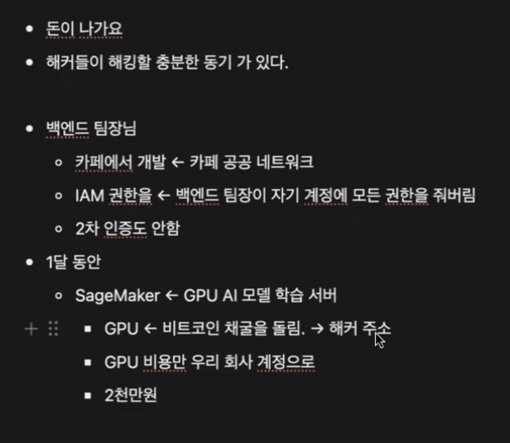
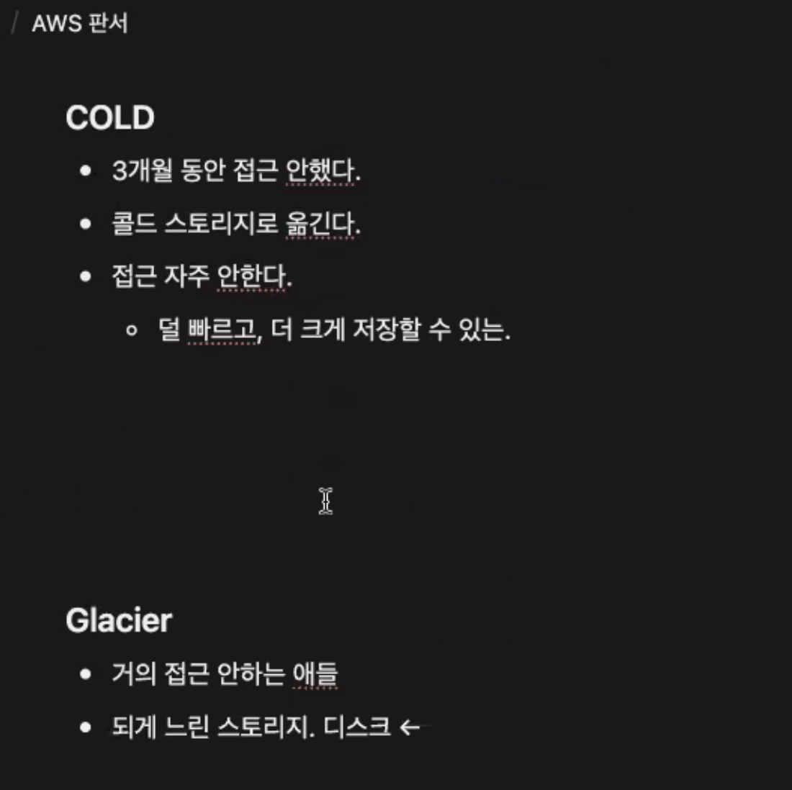
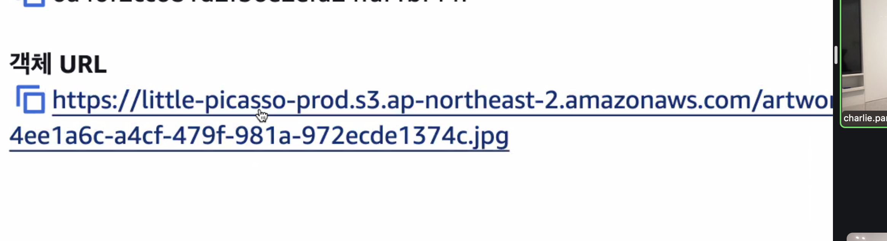
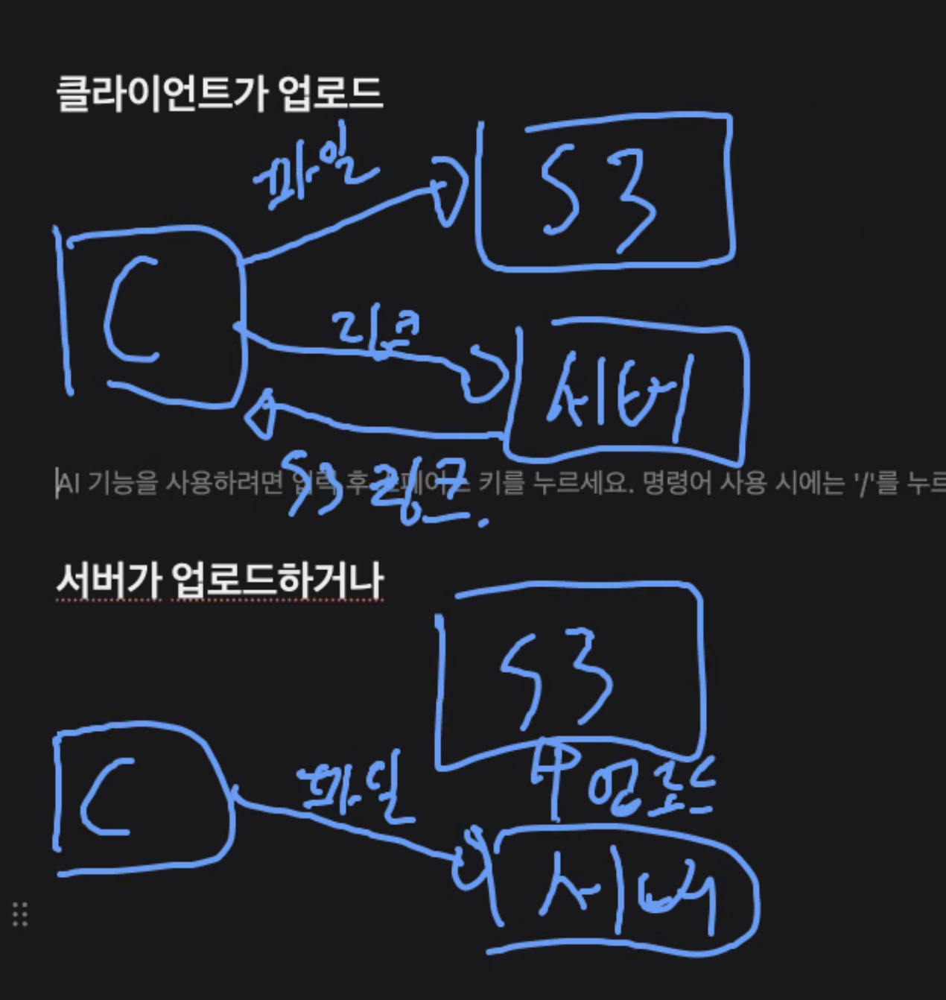
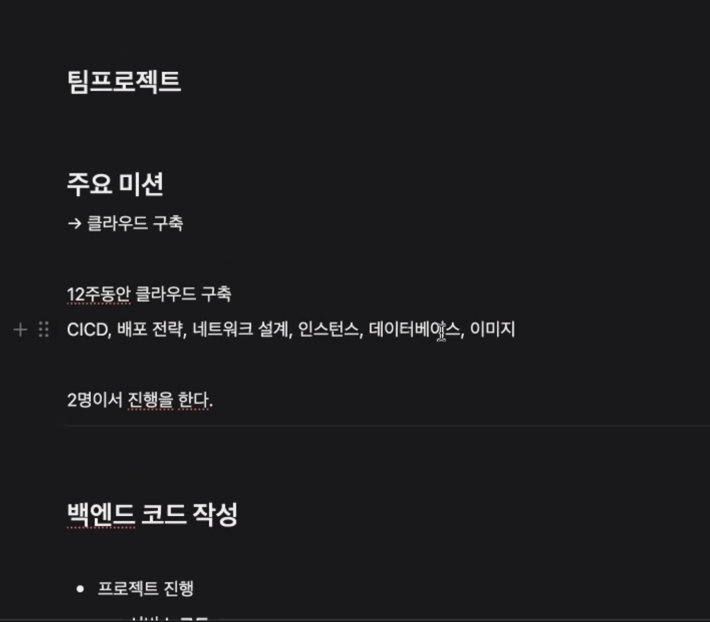
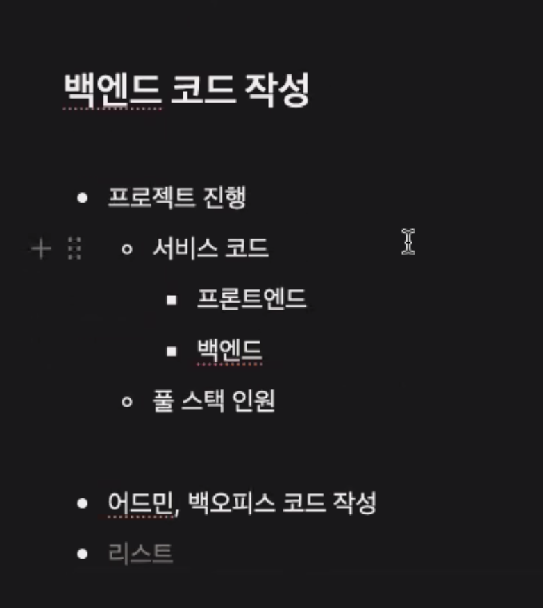
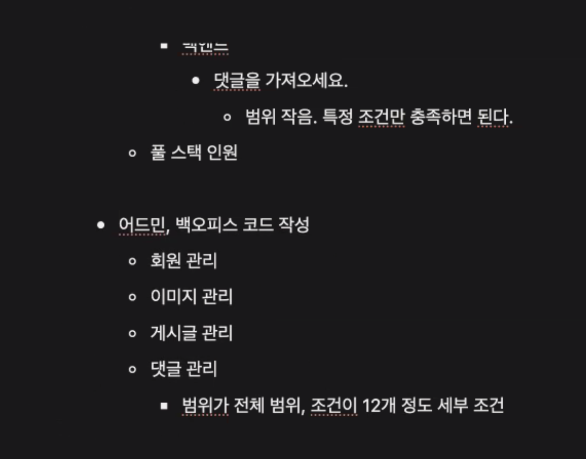
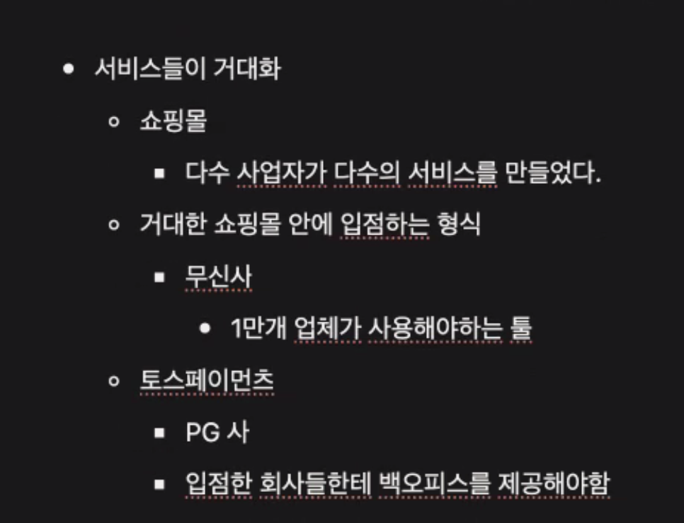
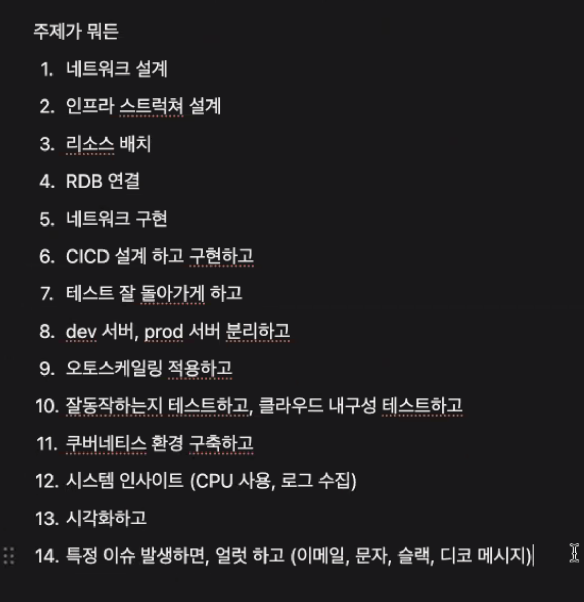

## 스크럼

### 오늘 배울 내용

- VPC
- 보안 그룹
- EC2
- EFS
- S3


### 복습 및 추가 학습

- 없음

### 과제

- 없음

## 새로 배운 내용

### 주제 1: 주제에 대한 설명

- 
    - 백엔드 팀장이 IAM에 모든 권한을 줘버림. 공공 네트워크에서 일하다가 계정 정보가 털림.
    - 해커가 GPU로 코인 채굴함.
    - 1달 뒤 알아서 2천만원 청구가 됨.
    - AWS에 사정, 사정해서 겨우 할인 받아 청구함.
- 
- 
- 
```
@charlie.park(박천명)/클라우드 주강사 

S3 버킷명과 경로가 노출 되면 누군가 악의적으로 계속 호출해서 네트워크 비용을 나오게 할 수 있다라고 이해했습니다.

그래서 직접 노출하지 않고, Route53이나 CloudFront 서비스를 사용해서 다른 URL로 바인딩 한다는 것을 이해했습니다.

—

아까 S3 객체 URL 노출 하셨습니다.

악의적인 마음을 가진 자윤 같은 사람이 공격하는 것도 내부에서 대비를 해두셨나요? 후후

애초에 S3로 외부에서의 직접적인 접근을 막는 것으로도 충분히 막을 수 있긴 하네요
```

### 이후 팀프로젝트
- 
    - 
        - 하지만 무조건 필수 조건을 전부 마치고, 강사의 허락이 떨어져야만 가능하다.
        - admin이나 백오피스 코드 정도는 짤 수 있다.
        - 프론트도 하게 된다. 그래서 SSR로 타임리프를 사용하게 됨. 아마 LLM으로 하게 됨.
            - 하고 싶은 것에 따라 다른 라이브러리를 사용할 수도 있음
        - 회원, 이미지, 게시글, 댓글
    - 
    - 
    - 배치 프로그램
        - 하루 또는 시간 단위로 동작해야 하는 백엔드 프로그램
    - 단 무조건 CI/CD, 배포 전략, 네트워크 설계, 인스턴스, 데이터베이스, 이미지, 오토 스케일링 설정 등 전부 마무리를 해야 가능하다.
- 

## 오늘의 도전 과제와 해결 방법

- 도전 과제 1: 도전 과제에 대한 설명 및 해결 방법

## 오늘의 회고
```
성공적인 점, 개선해야 할 점, 새롭게 시도하고 싶은 방법 등을 포함할 수 있습니다.
보통 기술은 풀고자 하는 문제가 있습니다.

기존에 어떤 문제가 있었고, 그걸 어떻게 풀려고 했는지.

이 방식으로 접근하면 기술이 나온 본질적인 이유와 그걸 풀어나가는 방법 에 대해서 알 수 있어요.

그렇게 초기 지식을 쌓고,

깊게 들어가야 하는 경우.
이제 그 때 해당 기술에서만 제공하는 기능이나. 동작 방식들을 공부하면 됩니다. 

그렇게 해야 넓고 깊게 알 수 있어요.

넓고 얕게 - 기존 문제와 해결 방식 을 알고 

깊게 - 기술이 이 문제를 구체적으로 어떻게 해결하는지, 그래서 생기는 특징이 뭔지 등

이렇게 학습하는게 장기적으로 유리합니다.
```

## 참고 자료 및 링크

- [링크 제목](URL)
