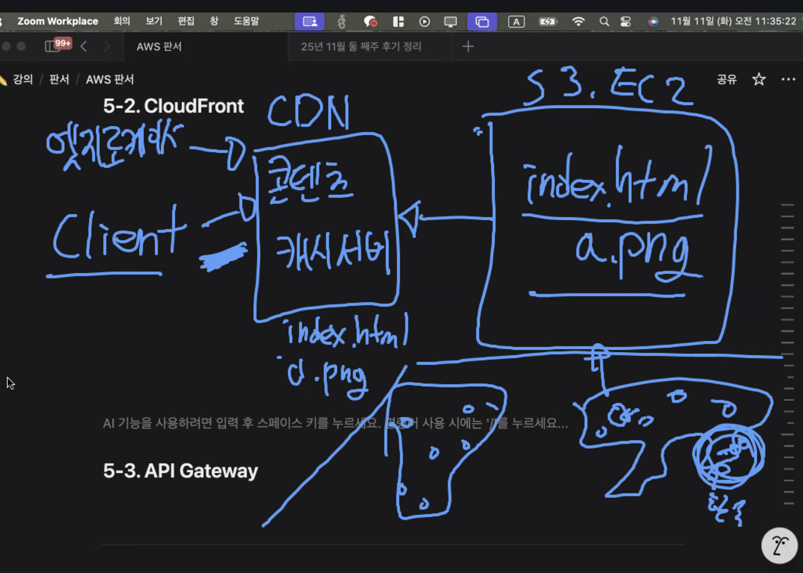

## 스크럼

### 오늘 배울 내용

- 애플리케이션 배포 및 데이터 서비스
 (RDS, ElastiCache, Athena)
- 트래픽 분산과 컨텐츠 전송
 (ELB, CloudFront, API Gateway)

### 복습 및 추가 학습

- 없음

### 과제

- ELB 다중 EC2 설계
- lambda, api gateway 이미지 업로드 및 pre-signed URL API 구현
- 클라우드 구성의 고민이 필요하다.
    - 프리터어 했다면 왜 했나요?
    - 서브넷 나눴으면 왜 이렇게 나눴나요?
    - 서비스 많이 해도 상관 없다. 하지만 왜 그랬나요?
    - 그리고 꼭 꺼라

## 새로 배운 내용

### 주제 1: 주제에 대한 설명

- 
    - 엣지 로케이션: 지리적으로 분산된 노드
    - CDN 쓸 때 데이터 동기화를 해야 한다.
        - 데이터 무효화를 해서 CDN이 직접 서버에 요청해서 새로운 데이터를 갖고 오도록 해야 한다.
        - 배포 script를 통해 이를 진행하기도 한다.

## 오늘의 도전 과제와 해결 방법

- 도전 과제 1: 도전 과제에 대한 설명 및 해결 방법

## 오늘의 회고

- 성공적인 점, 개선해야 할 점, 새롭게 시도하고 싶은 방법 등을 포함할 수 있습니다.

## 참고 자료 및 링크

- [링크 제목](URL)
