## 스크럼

### 오늘 배울 내용
- CIDR, VPC, Lambda

### 복습 및 추가 학습

- 없음

### 과제

- ELB 다중 EC2 설계
- S3 설계
    - 프론트 정적 페이지
    - 이미지 저장
- S3 설정

## 새로 배운 내용

### 주제 1: 주제에 대한 설명

- 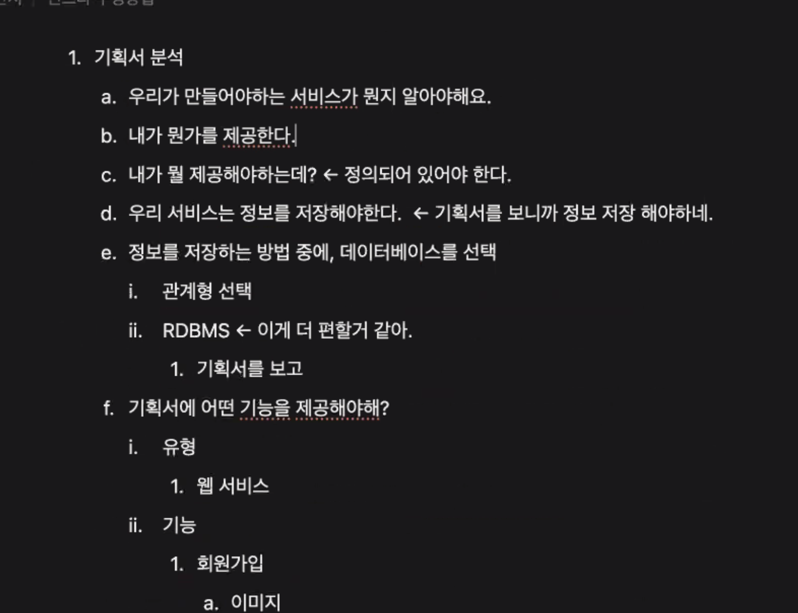
- 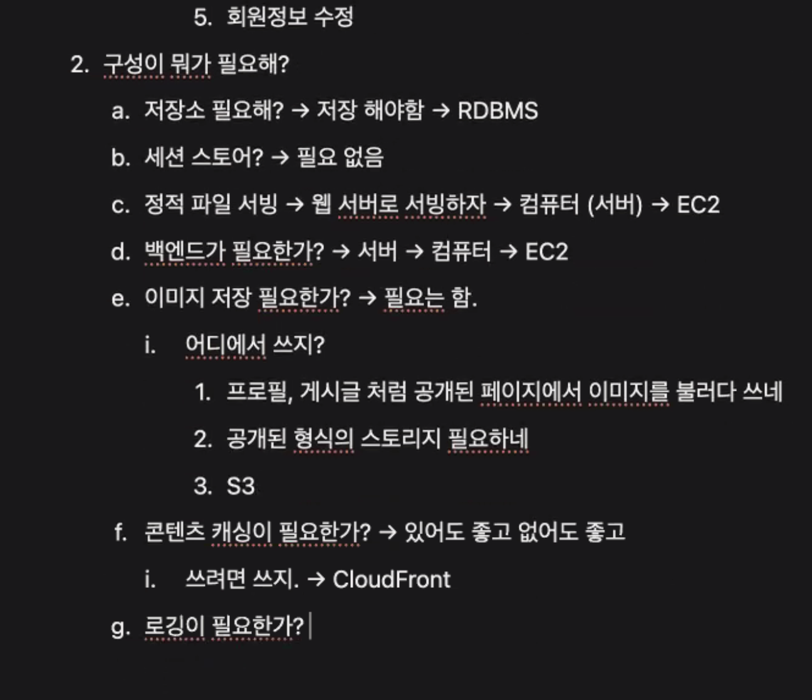
- 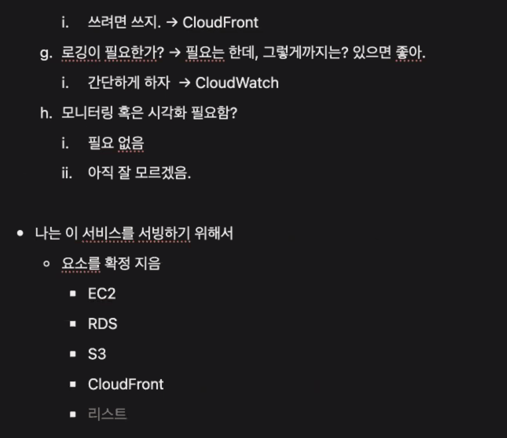
- 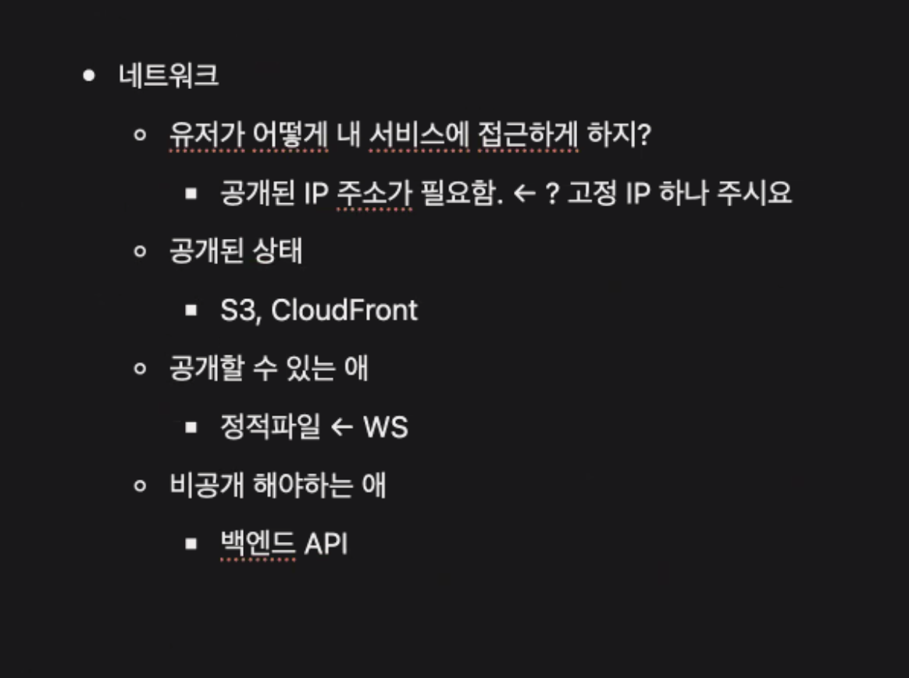
- 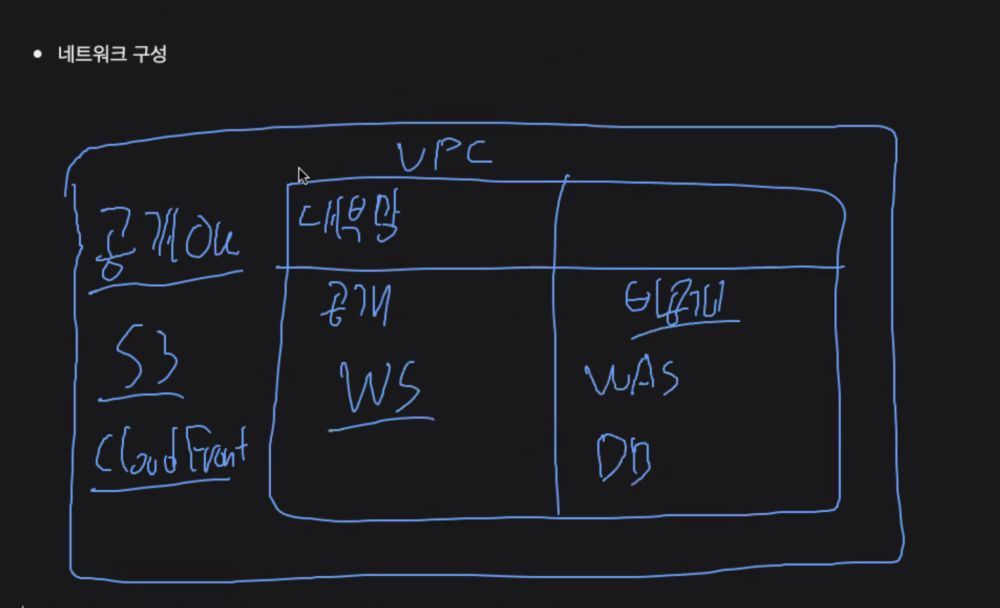
- 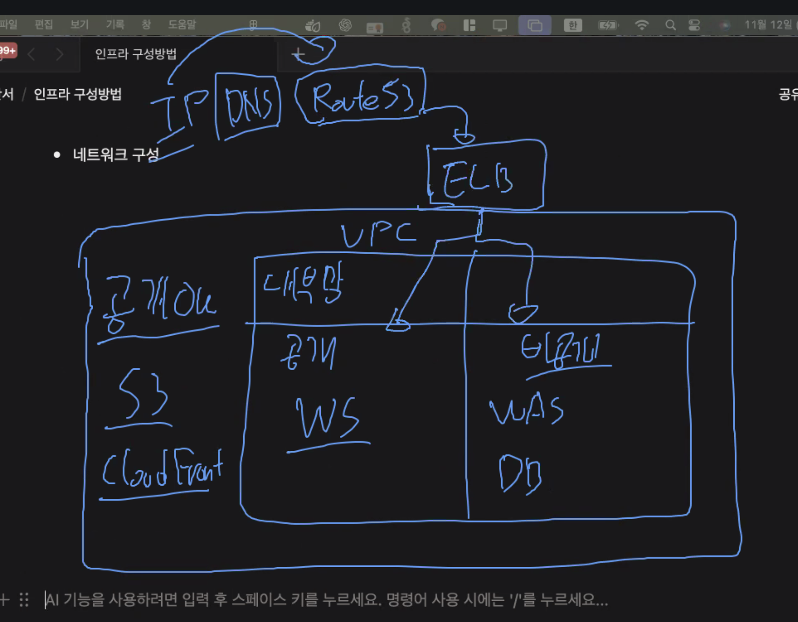
- 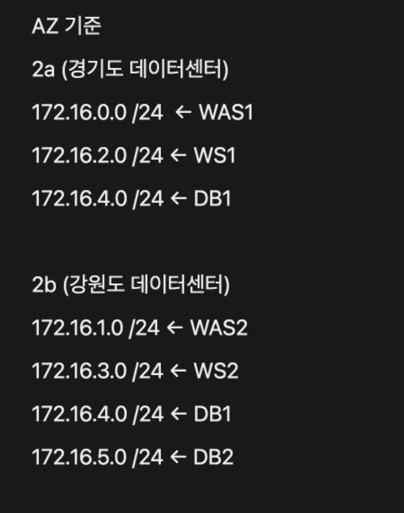

### 주제 2: 주제에 대한 설명
- 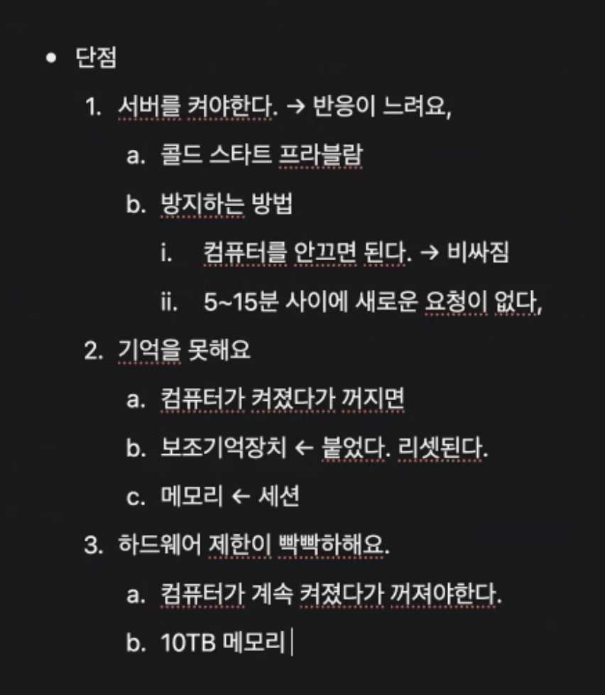
- 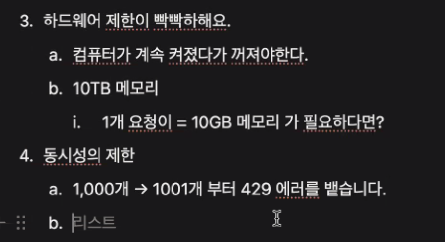
- 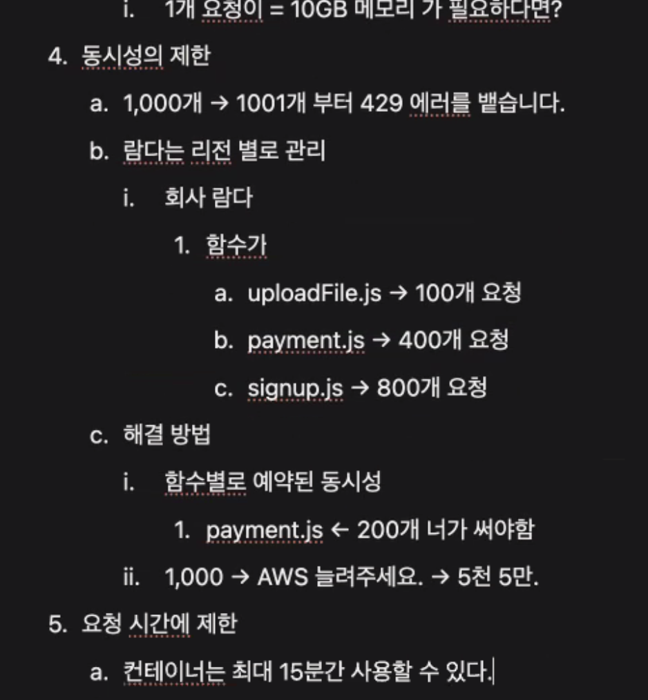
- 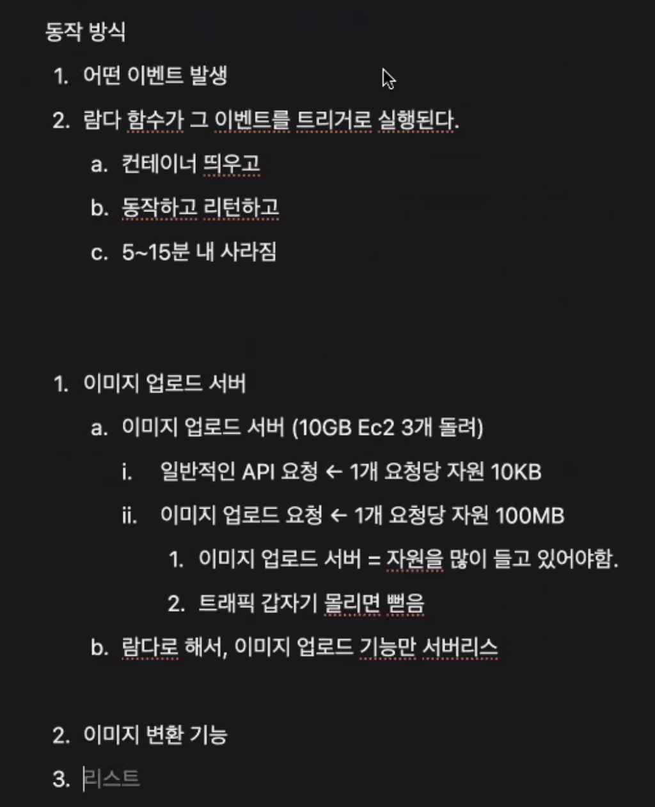
- 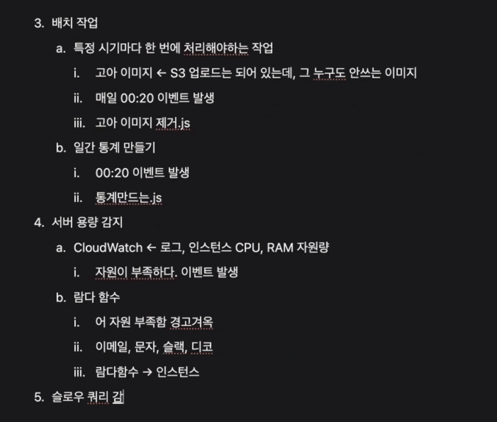

## 오늘의 도전 과제와 해결 방법

- 도전 과제 1: S3 권한 문제 해결
```
{
    "Version": "2012-10-17",
    "Statement": [
        {
            "Sid": "Statement1",
            "Effect": "Allow",
            "Principal": "*",
            "Action": [
                "s3:GetObject",
                "s3:PutObject"
            ],
            "Resource": "arn:aws:s3:::jayoon-bucket/*"
        }
    ]
}
```
## 오늘의 회고

- 성공적인 점, 개선해야 할 점, 새롭게 시도하고 싶은 방법 등을 포함할 수 있습니다.

## 참고 자료 및 링크

- [링크 제목](URL)
