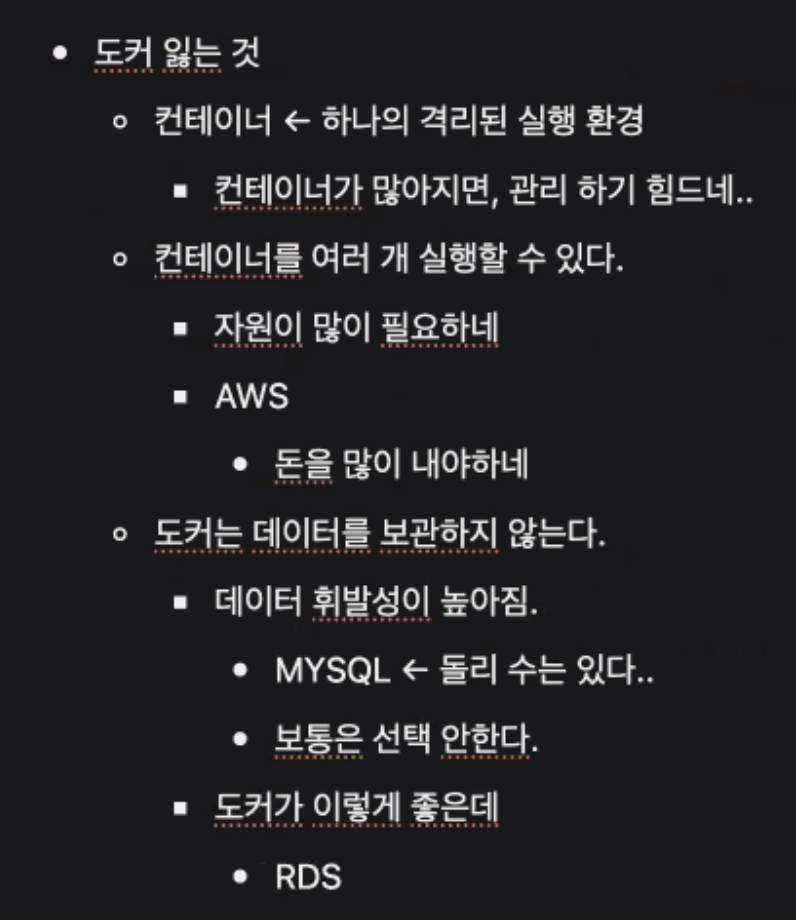
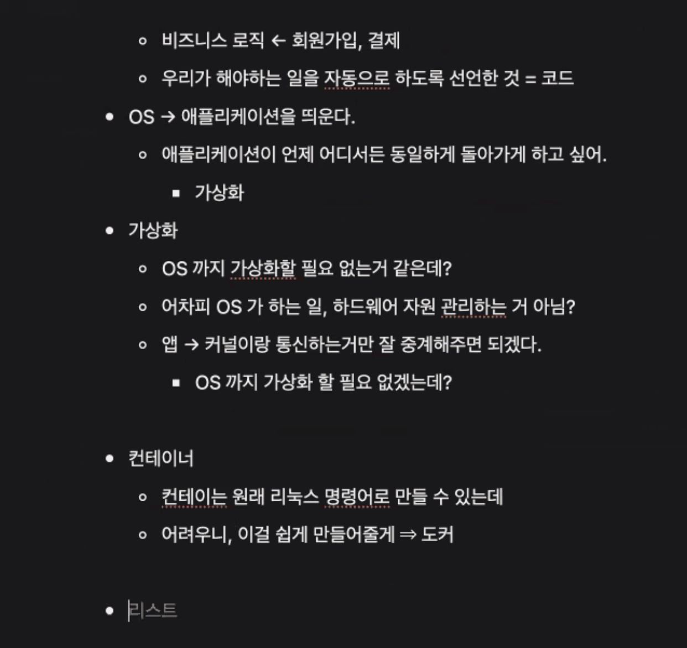

## 스크럼

### 오늘 배울 내용

- 가상화
- Docker
- Dockerfile
- Docker Image
- Docker Container
- Docker Registry

### 복습 및 추가 학습

- 없음

### 과제

- 없음

## 새로 배운 내용

### 주제 1: 나를 정의하는 것, 지식은 계속 부족하다 느껴지는 시대, 어떻게 해야 하나?

- 취업을 하기 위해서는 무엇인가를 배우는 게 중요한 게 아니라 나를 정의하는 것이 중요하다.
- 괜히 무엇이 궁금한 것 같아서 계속 무엇인가를 배우려고 한다.
- 뭔가 꼭 알아야 할 것 같고, 꼭 무엇인가 해야 할 것 같다. 이것들은 전혀 중요하지 않다.

### 주제 1: Docker

- 
- 
- OS -> 서비스 격리 -> 가상화 -> 컨테이너 -> 도커
- OS까지 가상화 하는 것은 많은 비용이 든다. 그럼 앱과 커널이 통신하는 것만 잘 만들어주면 되겠네?
    - 컨테이너는 리눅스 기능
    - 너무 어려우니 이를 쉽게 사용할 수 있는 기술 -> 도커
- 도커가 많아져
    - 관리의 어려움을 해결하기 위한 쿠버네티스 등장

## 오늘의 도전 과제와 해결 방법

- 도전 과제 1: 도전 과제에 대한 설명 및 해결 방법

## 오늘의 회고

- 성공적인 점, 개선해야 할 점, 새롭게 시도하고 싶은 방법 등을 포함할 수 있습니다.

## 참고 자료 및 링크

- [링크 제목](URL)
