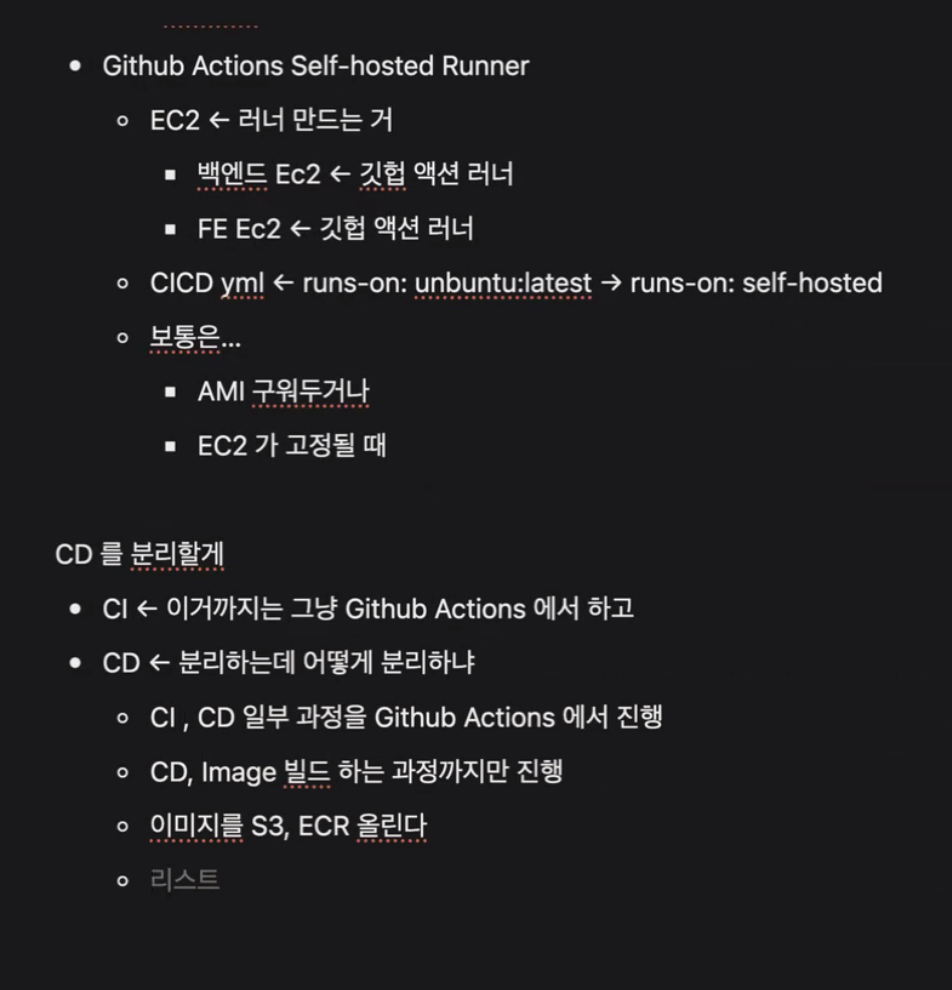
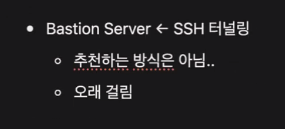
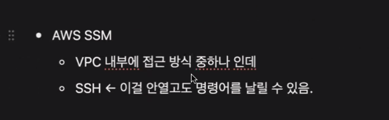

# 스크럼

## 1. 오늘의 주요 일정 (Events/Schedule)
- 17:00 하루 복기 및 공유

## 2. 오늘 완수할 일 (Tasks)
- docker compose
    - BE, MySQL, FE 연결 확인
- CI 구성
    - 이미지 빌드
    - 테스트 코드

## 3. 이슈 및 질문 (Blockers / R&D)
- 없음

# 새로 배운 내용

## 주제 1: Private subnet에 있는 EC2 CI/CD 처리

- 
- 
- 
- Code deploy 또는 ECR 찾아보기

# 오늘의 도전 과제와 해결 방법

- 도전 과제 1: 도전 과제에 대한 설명 및 해결 방법

# 오늘의 회고

- 성공적인 점, 개선해야 할 점, 새롭게 시도하고 싶은 방법 등을 포함할 수 있습니다.

# 참고 자료 및 링크

- [링크 제목](URL)
