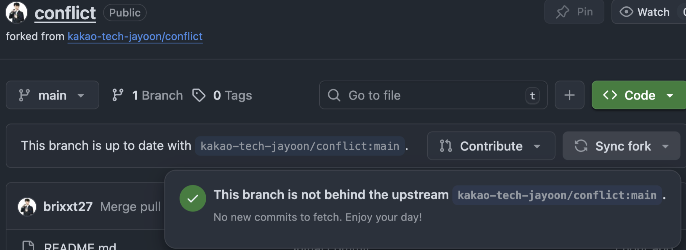
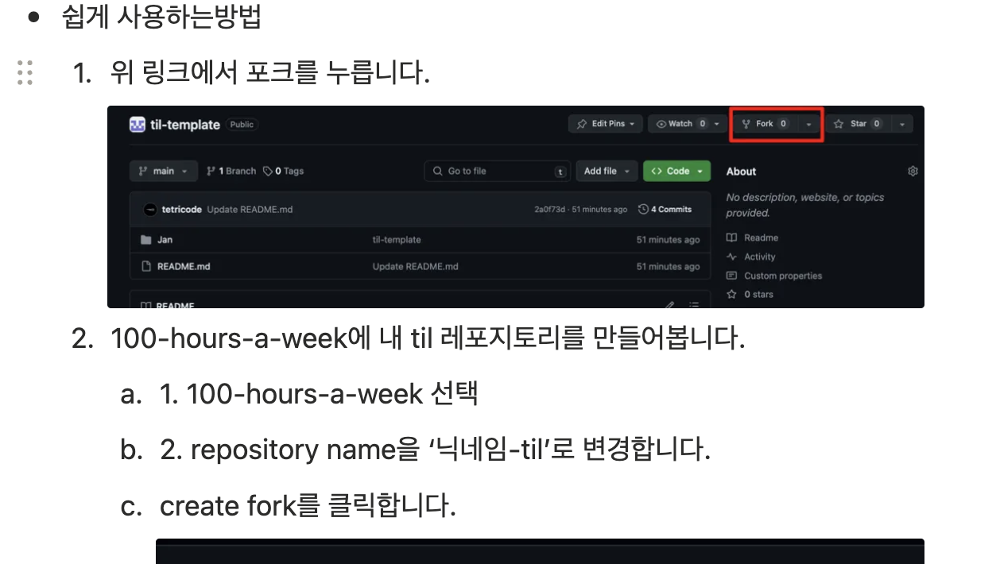

## 스크럼
### [교재 1회독]
#### 오늘 배울 내용
- git(계획 듣고 구체화 하기)
- 미니 퀘스트 1~3 완료

#### 복습 또는 심화학습
- HTML, CSS

### [추가 학습]
- 없음

### [과제]
#### 4주차
- API 서버 구현: 유저 구현 마무리


## 새로 배운 내용
### git pull upstream main과 github Sync fork 버튼

git 미니퀘스트 3번까지 완료했습니다! Github의 Sync fork 버튼을 눌러서 origin을 최신화 해본적은 있어도 직접 git pull upstream main명령어로 local을 최신화 해본적은 처음이었습니다.

### git revert
보통 git reset -soft,  등으로 불필요한 커밋을 날려서 해당 커밋의 파일을 Staging이나 Untracking 상태로 만들었다. 하지만 협업을 하면 커밋 자체가 이후에 중요한 데이터가 되므로 커밋을 옮기는 것 자체가 저장이 되는 revert를 사용하는 것이 추천된다.

## 오늘의 도전 과제와 해결 방법
### Spring Security
```gradle
    implementation "org.springframework.boot:spring-boot-starter-security"
```
위 문장을  build.gradle 파일에 추가하면 Spring은 자동으로 Spring securiry를 추가한다. 떄문에 모든 리소스 요청에 인증 및 인가 처리가 필요해진다.

### Spring security가 bcrypt 암호화 알고리즘을 다루는 방법
 
순수한 bcrypt 암호문은 60자입니다. 하지만 SpringSecurity는 인코딩할 때 어떠한 암호화 알고리즘을 사용했는지 알기 위해 접두사를 붙입니다.

{접두사} + {암호화 된 값}

bcrypt 알고리즘 ID 8자와 암호화 된 값 60자를 해서 총 68자를 저장합니다.이후 bcrypt 알고리즘이 취약해질 수 있으므로 유동적인 DB 설계가 필요합니다.

### Github 잔디를 심기 위한 사투...
github는 fork를 해서 코드를 작성했을 때 최종적으로 merge가 되지 않으면 사용자의 잔디로 인정해주지 않습니다. 때문에 최종적으로 merge를 하면 안 되는 저장소를 포크해서 진행하면 안 됩니다. merge를 하면 안 되는 이유는 upstream이 템플릿을 저장하는 저장소이기 때문입니다. 저의 목적은 아래와 같습니다.
- 개인 저장소가 아닌 Organization에 저장소를 저장하여 사용한다.
- 템플릿을 가져와서 사용한다.
- Github 잔디를 채운다.

저는 이를 해결하기 위해 저장소에서 템플릿을 받은 뒤 Organization에 독립적인 저장소를 만들었습니다. 이후 작업을 하니 잔디로 인정 받을 수 있었습니다.


기존에는 위처럼 가이드가 나와있어서 이대로 따라했다가 문제를 만났고, 위와 같은 방식으로 해결할 수 있었니다.
### 오늘의 회고


### 참고 자료 및 링크
- [Spring security Bcrypt 알고리즘 공식문서](https://docs.spring.io/spring-security/reference/features/authentication/password-storage.html#authentication-password-storage-dpe)
