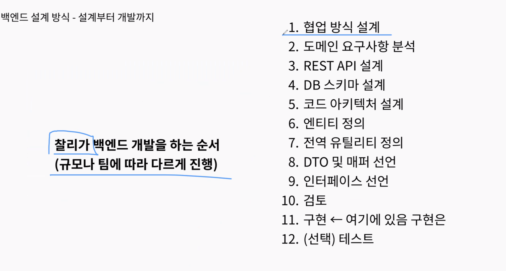

## 스크럼

### 오늘 배울 내용

- 없음

### 복습

- 없음

### 추가 학습

- 없음

### 과제

- 없음

## 새로 배운 내용

### 주제 1: 주제에 대한 설명

- 상세 내용 1

### 주제 2: 주제에 대한 설명

- 상세 내용 1

## 오늘의 도전 과제와 해결 방법

- 도전 과제 1: 도전 과제에 대한 설명 및 해결 방법

## 오늘의 회고

### DTO에 대한 회고

#### DTO의 역할

- 책임 분리
- JSON API 응답 시 연관 관계를 갖고 있는 엔티티끼리의 순환 참조 문제 해결

### DTO 생성은 Controller vs Service

###

### 찰리의 설계 및 구현

1. 협업 방식 설계: convention 등 협업을 위한 형식 지정.
2. 도메인 요구사항 분석: API Docs를 제대로 설계했다면, 어떤 도메인의 우선순위가 높으며, 어떤 API를 먼저 만들어야 하는지 등을 고민하기.

## 참고 자료 및 링크

- [링크 제목](URL)
