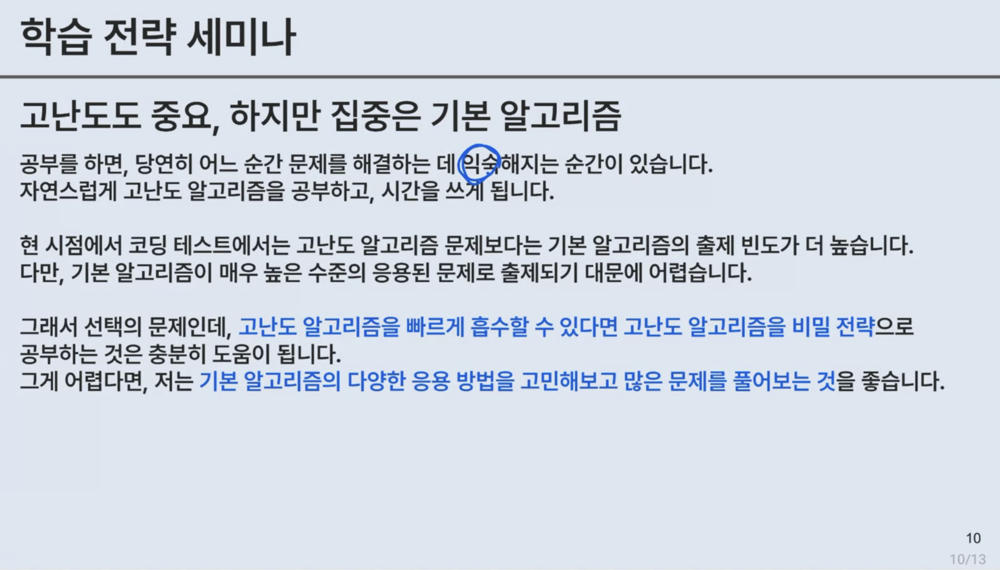

## 스크럼

### 오늘 배울 내용

- 백엔드 설계와 구현 방식
- 스프링 백엔드 과제 톺아보기

### 복습 또는 심화 학습

- 없음

### 과제

- [ ] frontend

  - [ ] 유저 관련 모든 페이지 HTML, CSS 완료 구현
    - [ ] login
    - [ ] signup
    - [ ] 회원 정보 수정
    - [ ] 비밀번호 수정

- [ ] backend
  - [ ] common 패키지가 생겼으니 기존에 전역으로 사용하던 패키지 구조 정리
  - [ ] 코드 컨벤션 설정
  - [ ] 리드미 문서 작성(코드, 깃, API 명세서, ERD 등)
  - [ ] User 도메인 구현 완료
  - [ ] Global exception handler 및 필요한 커스텀 클래스 구현

## 오늘의 회고

### DTO에 대한 회고

#### DTO의 역할

- 책임 분리
- JSON API 응답 시 연관 관계를 갖고 있는 엔티티끼리의 순환 참조 문제 해결

### DTO 생성은 Controller vs Service

- ??

## 코딩 테스트 특강

- 언어에 대한 DOCS를 읽어본 적이 있나? 생각 보다 언어에 굉장히 가까운 문제들이 많이 나온다.

- 개발은 소설에 가깝다. 하지만 알고리즘 시험은 문법 시험에 가깝다. 문법이 틀린다면 무조건 틀린다.
- 개념과 논리를 알고 있다고 해도 문법을 우리는 생각보다 모르기 때문에 시험 때는 기억이 나지 않는다.

- 외워서 푸는 문제는 없어졌다. 논리적인 생각이 중요하다.
- 즉 실직적으로 문제를 해석하고, 알고리즘을 분석하는 시간이 더 오래걸린다.

- 기초 구현부터 시작하라.
- 이젠 알고리즘 문제에 기초 구현 능력을 요구한다. 알고리즘 문제는 이미 최적화가 많이 되어 있다. 하지만 기초 구현은 최적화 되어 있지 않다.
- [백준 별 찍기 시리즈](https://www.acmicpc.net/workbook/view/20) 이런 기본 기초 구현 능력부터 키워라.
- 알고리즘만 다 외운다고 풀 수가 없다. 준비를 처음 시작한다면 '구현' 능력이 있어야 한다.

- 알고리즘은 앞서 이야기 했듯이 이미 최적화가 되어 있다. 때문에 암기를 할 수가 있는데 이해 없이 외우는 것은 전혀 의미가 없다. 지금은 더이상 외운 코드로는 합격을 받을 수 없다.

1. 매일 꾸준히 백준 아무런 문제를 들어가서 일반적인 나의 언어로 정리를 해봐라.
2. 백준 로그인을 하면 유형이 뜬다. 이것이 정답지이다. 때문에 정리 마지막에 찾아봐라.
3. 위 1, 2를 반복하다 보면 정답이 보인다. 정리하는 것이 10분도 걸리지 않기 때문에 매일 해봐라.
4. 위 연습은 문제를 해석하고, 알고리즘을 고민하는 시간을 줄여준다.

- 위 예시만 보고도 Segment tree를 사용해야만 풀린다는 것을 알아야 한다.
- 하나씩 따져봐서 바로 알고리즘과 자료구조를 선택할 수 있는 경지는 노력으로만 이뤄지다.
- 이를 매일 연습하는 것은 알고리즘 경진대회를 위한 준비이다. 코테를 위한 것이라면 2~3개월이면 충분하다.

- 총 시험 문제 7개라면 4.5개 정도 맞춰야 합격할 수 있다.
- 7번은 대학원을 가야만 풀 수 있는 정도의 수준이다.

- 각 회사에서 사용하는 평가 플랫폼에 들어가서 문제를 풀어봐야 한다. 왜냐하면 언어 버전이 다르기 때문이다.
- 프로그래머스는 문제들이 함수형으로 입출력을 다루지 않는다. 이에 반해 백준 등의 문제는 입출력을 다루고, 일반형인 main문을 다룬다.
- 그렇기 때문에 프로그래머스로만 연습하다보면 입출력을 못 다룰 수도 있다. 예를 들어 '19 5'라고 들어오면 split()을 몰라서 이 두 문자열을 꽤 많이들 다루지 못한다.
- 카카오는 구름을 사용한다.

- 4문제 1시간이면 다 맞아야 한다.
- 파라메트릭 서치는 비전공자를 가려내기 용으로 보여진다. 좌표 평면 등의 개념이 필요하다.
- 다익스트라: 매우 어려움
- 누적합과 segment tree 구분하기
- MST(최소신장트리)

- 삼성 SDS에서만 나오는 어려운 문제 존재.
- 폴리곤은 관심 갖지 마라. 출제를 여기서 하는 것으로 알고 있는데 보지 마라.

### Q&A

#### Q) 연습은 어떻게 하나요?

A) 백준 > 문제 > 분류에서 특정 주제를 선택하여 레벨 별로 정리 되어 있으니 풀어봐라.

#### Q) 모의고사는 어떻게 보나?

A) 대학교 대회 세트, 익숙한 대학 선택하여 30~70% 정답 비율을 갖고 있는 문제 네 개를 미리 묶어서 2시간 씩 풀어봐라.

대학교 코테 문제를 내는 사람이 결국 코테를 출제한다. 대학교 코테 문제를 푸는 게 바로 코테 모의고사에 가깝다.

#### Q) 얼마나 고민하면 좋나요?

A) 문제를 너무 오래 고민하지 마라. 취업 준비생은 한 문제 당 길어봤자 두 시간만 고민해라. 실수한 부분이 사소한 부분일 수 있고, 아예 모르는 알고리즘일 수도 있다.

#### Q) 어느 정도의 시기와 레벨을 선택하여 공부하면 되나요?

A) 매일 매일 쉬운 문제 풀어보기. 그래야 구현 능력이 올라간다. 위 사진에 적은 레벨을 매일 조금씩 풀어봐라.

### 찰리의 설계 및 구현

1. 협업 방식 설계: convention 등 협업을 위한 형식 지정.
2. 도메인 요구사항 분석: API Docs를 제대로 설계했다면, 어떤 도메인의 우선순위가 높으며, 어떤 API를 먼저 만들어야 하는지 등을 고민하기.

