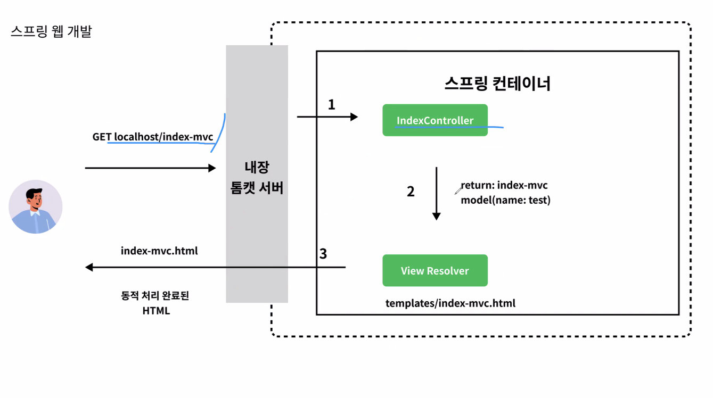
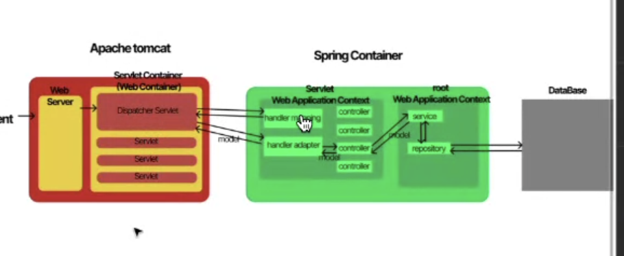

## 스크럼

### 오늘 배울 내용

- 서블릿
- 디스패처 서블릿
- 핸들러 매핑
- 핸들러 어댑터
- 뷰 리졸버
- 스프링MVC
- 템플릿엔진
- 타임리프

### 복습

- 없음

### 추가 학습

- 없음

### 과제

- login 페이지 HTML 수정
  - padding으로 인한 튀어나온 input UI box-sizing: border box로 수정

## 새로 배운 내용

### Servlet과 Spring template engine, 그리고 Thymleaf

- 서블릿(Servlet)
  - 서블릿은 동적 페이지를 만들기 위한 것이다.
- [디스패처 서블릿(Dispatch Servlet)](https://docs.spring.io/spring-framework/reference/web/webmvc/mvc-servlet.html)
  - 클라이언트의 요청 및 응답을 IoC 형태로 다룬다.
  - 다른 많은 웹 프레임워크 처럼 Spring MVC는 central Servlet, DispatcherServlet에서 Front controller pattern을 사용합니다.
  - DispatcherServlet은 자바 config 파일 등을 사용하여 Servlet 명세를 통해 선언 되거나 매핑이 필요합니다.
- 핸들러 매핑(Hanlder Mapping)
  - 요청이 Dispatch Servlet을 거치면 핸들러 매핑을 통해 어떤 핸들러가 있는지 찾는다. 핸들러는 3 layer architecture인 Controller, Service, Repository으로 이루어져 있다.
- 핸들러 어댑터(Handler Adaptor)
  - 핸들러 매핑으로 찾은 핸들러를 선택하여 다루는 역할을 한다.
- [뷰 리졸버(View Resolver)](https://docs.spring.io/spring-framework/reference/web/webmvc/mvc-servlet/viewresolver.html)
  - Spring MVC가 다른 뷰 기술 없이 브라우저에서 모델들을 렌더링 할 수 있도록 정의한 인터페이스입니다.
- [스프링MVC](https://docs.spring.io/spring-framework/reference/web/webmvc.html)
  - Spring Web MVC는 Servlet API를 기반으로 하는 웹 프레임워크입니다. 흔히 Spring MVC라고 알려져 있습니다.
- 템플릿엔진
  - Spring MVC는 동적 웹 컨텐츠를 렌더링하기 위해 다양한 템플릿 엔진을 지원합니다.개발자는 서버 측에서 해당 엔진을 사용하며 정적 HTML 또는 다른 동적 데이터를 다루는 markup을 통합 할 수 있습니다. 서버에서는 클라이언트에게 보낼 최종 결과물을 생성합니다.
- Thymleaf와 사용하는 이유
  - 별도의 frontend 프레임워크를 사용하지 않고, 스프링을 사용하는 SSR 형식의 웹 서비스를 사용하는 경우가 있다. 이때 사용하는 템플릿 엔진 중 하나가 타임리프입니다. 별도의 웹 페이지 요청 시 resource/templates/에 있는 파일을 불러오게 된다.
  - 
    

## 오늘의 도전 과제와 해결 방법

## 오늘의 회고

- 성공적인 점, 개선해야 할 점, 새롭게 시도하고 싶은 방법 등을 포함할 수 있습니다.

## 참고 자료 및 링크

- [링크 제목](URL)
