## 스크럼

### 오늘 배울 내용

- 스프링 테스트 코드

### 복습 또는 심화학습

- 없음

### 과제

- backend

  - 포맷팅 설정 완료
  - 게시물 생성 API 구현

- frontend

  - 회원 가입 화면 작업 및 연결
    - HTML
    - CSS
    - js
  - 게시물 생성 화면 작업 및 연결
    - HTML
    - CSS
    - js

## 새로 배운 내용

### 주제 1: 테스트

- 단위 테스트의 의도

  - 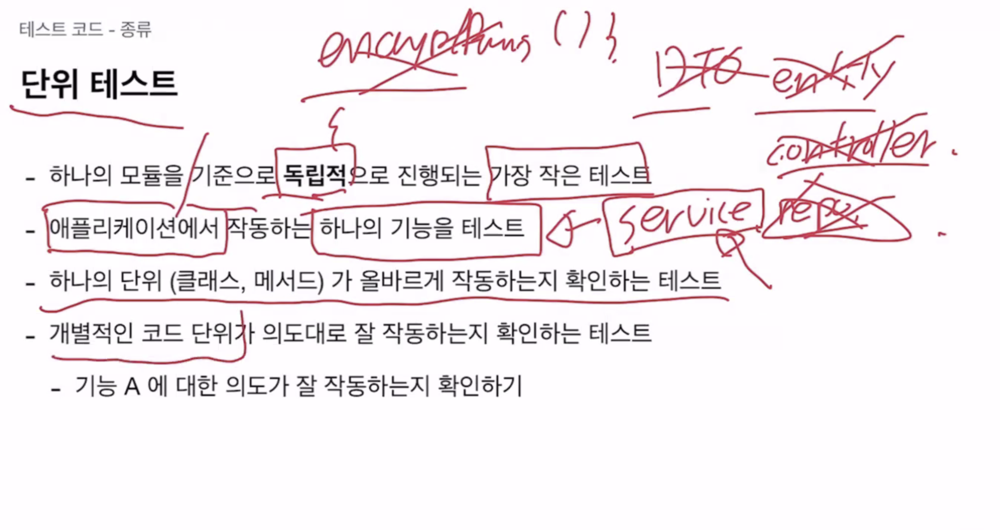
  - 작은 단위의 기능을 테스트한다.
  - 그러면 PasswordEncoder와 같은 인코딩 라이브러리도 테스트 해야 할까?
  - 결론부터 이야기 하자면 서비스 단위만 작성한다.
    - 해싱해주는 라이브러리는 이미 검증된 외부 라이브러리이다.
    - 컨트롤러, 레포지토리는 테스트 코드 작성할 필요가 없다.
  - Unit test에서 중요한 것은 대부분 실패 케이스이다. 성공 케이스는 아무리 작성해도 의미가 크게 없다.

- 그렇다면 서비스라면 모두 테스트 해야 할까?

  - 가치 있는 것을 테스트 해야 한다.
  - 회사 입장에서는 기능 구현할 시간에 의미 없는 테스트를 작성하는 상황으로 보일 수 있음.
  - 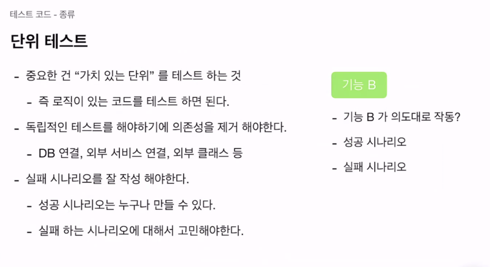

- 어떻게 해야 할까?

  - 최대한 의존성을 제거해야 한다.
  - 최소 단위이기 때문에 하나의 API 자체를 테스트 하지 못하고, 서비스의 특정 단위만 테스트 하게 된다. 때문에 이 서비스들이 모인 API를 실행 할 때의 모든 경우를 테스트 할 수 없다.

- 통합테스트

  - 지금은 작성하지 않는다.
  - 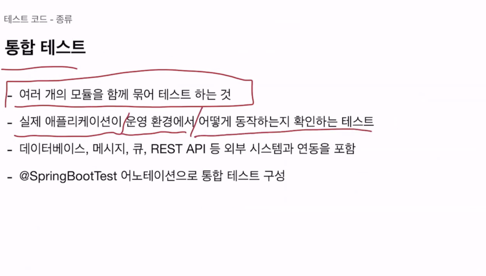

- 단위 테스트 원칙

  - 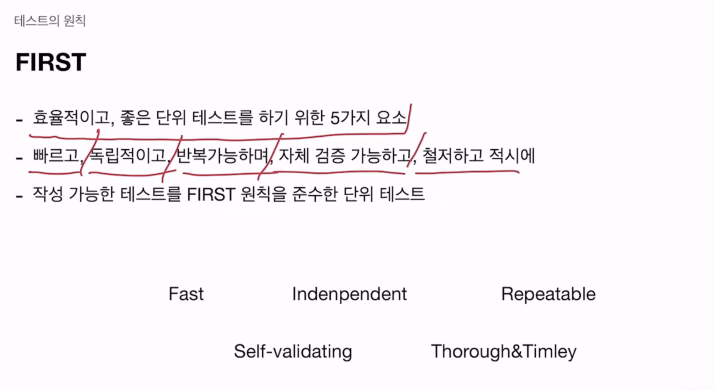
  - 단위 테스트는 자체로 실행 되어야 한다. A, B, C 테스트가 존재한다면 B는 A와 C 테스트 결과에 의존하면 안 된다.
  - 동작 순서가 보장 되지 않기 때문에 순서에 영향을 받으면 안 된다.

- 작성하는 방법

  - 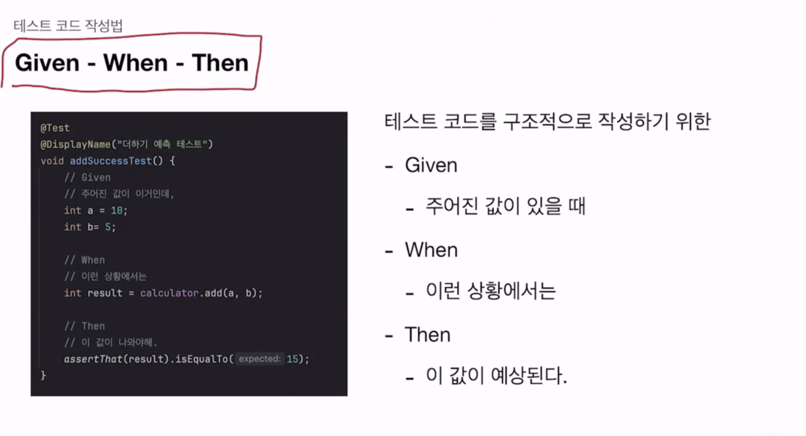
  - 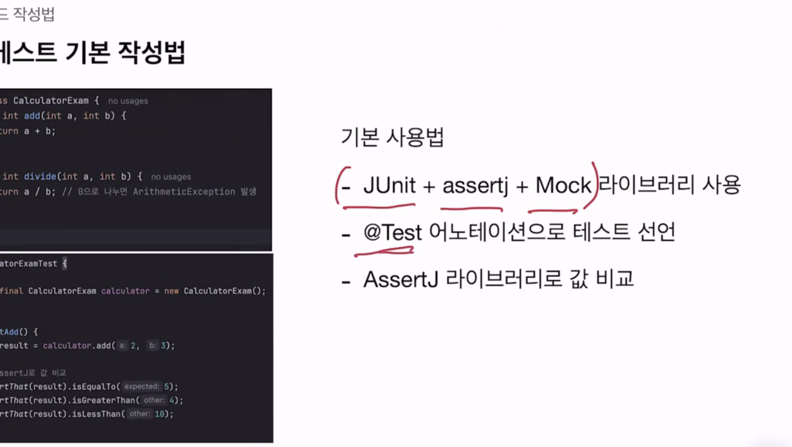
  - 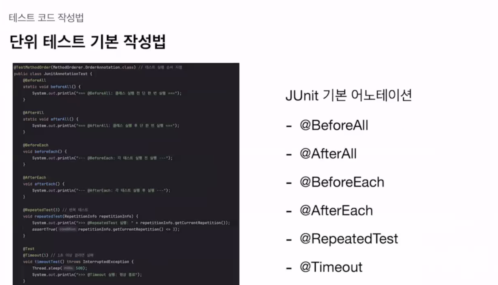
  - 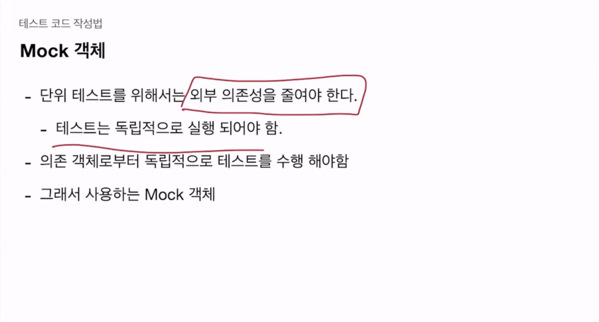
    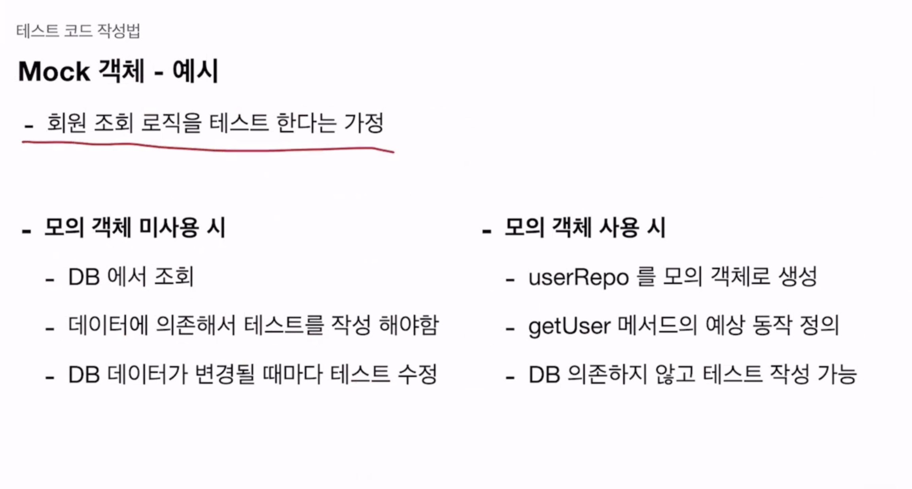
    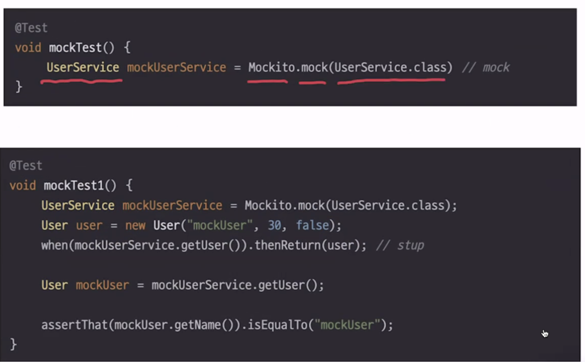
    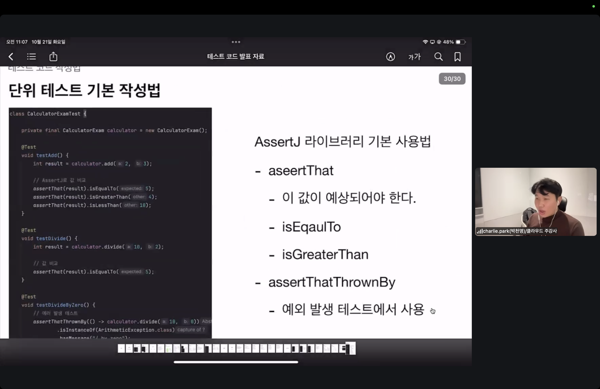
    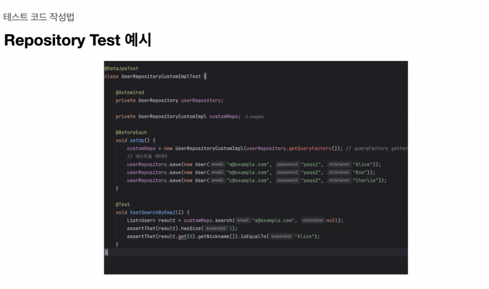
    - QueryDSL 등 커스텀 쿼리를 만들 때
    - @DataJpaTest는 기본 H2에만 저장하거나 날리는 방식 사용 가능?
    - 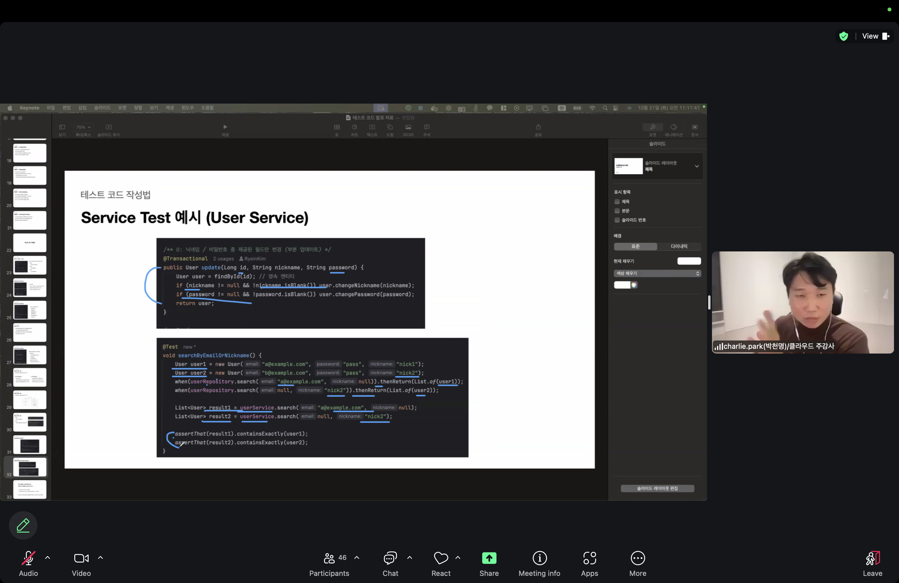
    - 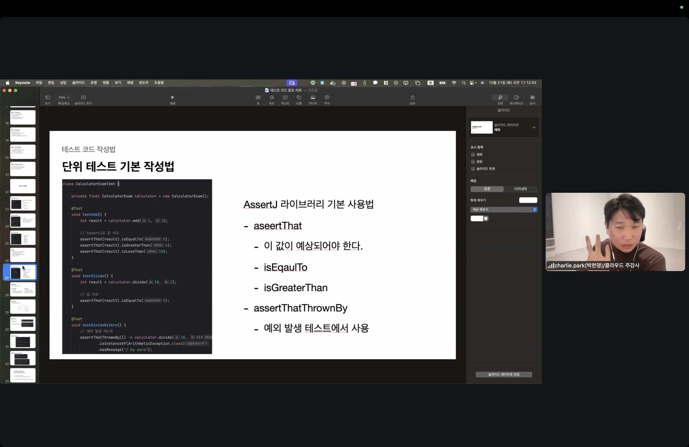

- 코드를 통한 사용 방법

```java
@ExtendWith(MockitoExtension.class) // JUnit에서 Mockito를 사용하기 위한 확장 기능
class UserServiceTest {

    @InjectMocks // @Mock으로 생성된 가짜 객체들을 이 클래스에 주입합니다.
    private UserService userService;

    @Mock // @InjectMocks에 의해 주입 될 가짜 객체 생성
    private UserRepository userRepository;

    @Mock
    private UserAuthRepository userAuthRepository;

    @Mock
    private Encoder encoder;

    @DisplayName("회원가입 성공 테스트")
    @Test
    void createUser_success() {
        // given (조건이 주어지고,)
        CreateUserRequest request = new CreateUserRequest("test@email.com", "password123", "testuser", "url");
        User savedUser = User.from(request);
        ReflectionTestUtils.setField(savedUser, "id", 1L); // savedUser 객체의 'id' 필드에 1L 값을 강제로 주입

        // Mock 객체의 행동 정의
        // BDD(Behavior Driven Development)를 따라 mockito 기본 API인 when이 아닌 wrapping한 given을 사용합니다.
        given(userAuthRepository.existsByEmail(request.email())).willReturn(false);
        given(userRepository.existsByNickname(request.nickname())).willReturn(false);
        given(encoder.encodePassword(request.password())).willReturn("encodedPassword");
        given(userRepository.save(any(User.class))).willReturn(savedUser);

        // when (무엇을 할 때)
        // @InjectMocks으로 인해 Mock 객체가 주입된 UserService::createUser를 실행하게 됩니다.
        // given()에서 주어진 값을 만났을 때 실제로 실행되지 않고, willReturn에서 정의한 값으로 대체됩니다.
        UserResponse response = userService.createUser(request);

        // then (결과는 이래야 한다)
        // assertThat은 상태를 검증한다.
        // verify는 행위를 검증한다.
        // 기본 타입은 상관 없지만, 사용자 지정 타입, class들은 equals를 오버라이딩 해야 내부 필드의 값을 올바르게 비교 가능합니다. 하지 않으면
        assertThat(response.userId()).isEqualTo(savedUser.getId());
        assertThat(response.nickname()).isEqualTo(savedUser.getNickname());
        assertThat(response.nickname()).isEqualTo(request.nickname());
        assertThat(response.profileImageUrl()).isEqualTo(savedUser.getProfileImageUrl());

        // verify는 when에서 호출한 기록을 보고 검증합니다.
        // @Mock이 Proxy 객체를 만들어 호출을 가로채고, 횟수를 기록합니다.
        // verify는 Mock 객체를 반환합니다.
        // How to: verify(①호출되었는지 검증할 Mock 객체, ②검증 조건).③호출되었어야 하는 메서드();
        // any()는 어떠한 값이 들어있든 상관 없이 해당 타입의 객체로 매핑해줍니다.
        // userRepository의 save가 User 객체를 인자로 1번 호출되었는지 검증
        verify(userRepository, times(1)).save(any(User.class));
        // userAuthRepository의 save가 UserAuth 객체를 인자로 1번 호출되었는지 검증
        verify(userAuthRepository, times(1)).save(any(UserAuth.class));
    }
}
```

### 이력서, 포트폴리오

- 구글 docs 버저닝
  - 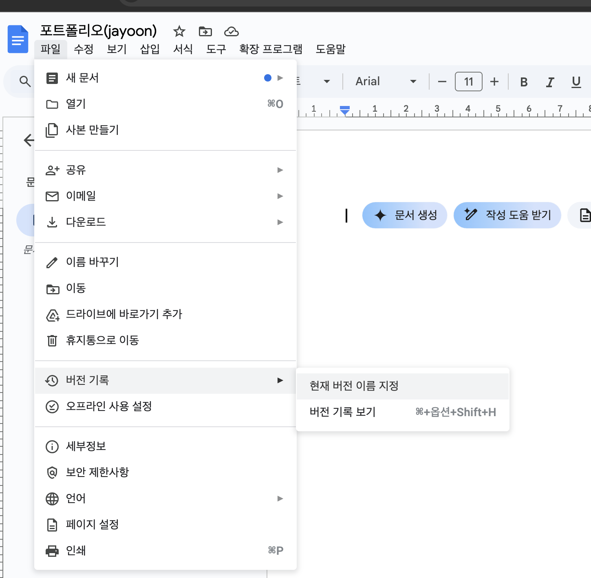

## 오늘의 도전 과제와 해결 방법

- 도전 과제 1: IntelliJ 포맷팅하기
  - 기존에 120자를 넘어도 계속 작성되는 것이 불편해서 적용하려 합니다.
  - 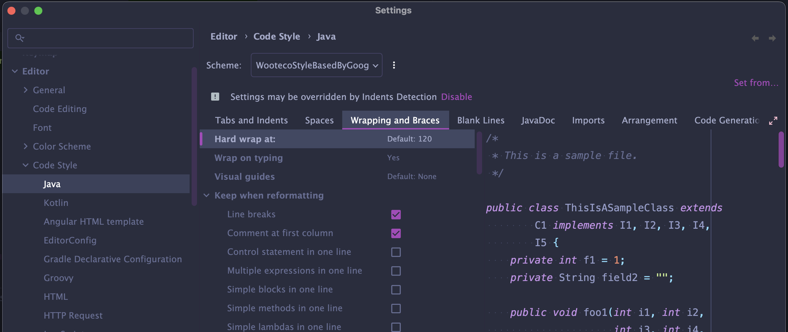

## 오늘의 회고

- 성공적인 점, 개선해야 할 점, 새롭게 시도하고 싶은 방법 등을 포함할 수 있습니다.

### 이번주 내에 작업 최대한 마무리 하기

- 포트폴리오로 이것을 사용했을 때의 포인트
  1. 클라우드 서비스인 AWS에 올려서 최적화를 해봤어?
  2. 그런데 서빙을 위한 백엔드도 구현했어?
  3. 거기에다 화면을 위한 프론트도 했다고?
- 위 순서를 적절히 기억해야 하고, 질은 떨어져도 일단 완성은 해보자.
- 목요일까지 이력서, 포트폴리오 내용 작성해두기

### Z index

- x, y, z 페이지는 3차원에 가깝다.
- 개발하면서 z index라는 키워드를 생각해라.
- JS는 총 3가지
  - 외부: api
  - 내부: 이벤트, 동적으로 html 만든다.

## 참고 자료 및 링크

- [링크 제목](URL)
