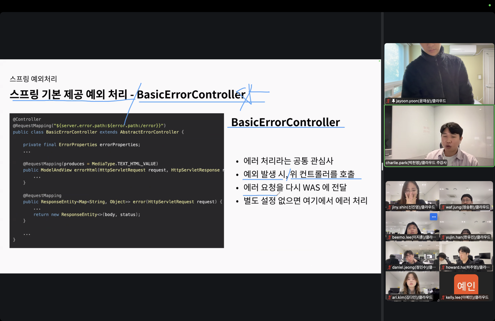

## 스크럼

### 오늘 배울 내용

- 없음

### 복습 및 추가 학습

- 없음

### 과제

- 없음

## 새로 배운 내용

### 주제 1: 테스트

- 
- 
- 
- 
- 
- 
- 
  - 복잡하면 컨트롤러 또는 도메인 모델로 나누어서 리팩토링 해야 한다.
  - 관심사 분리를 해야 한다.
  - 복작한 코드에서 당장 분리가 되지 않았는데 테스트 코드를 작성하면 굉장히 위험하다.
    - 하지만 그렇다고 지금 당장 볼 필요는 없다. 우선순위 생각하기
- 
- 
- 
- 
- 
- 
- 
- exception handler는 유의미한 응답이 어렵다는데 관련해서 찾아보기. basic e c의 아무 것도 하지 않을 때 나오는 white 어쩌고 에러 페이지 응답과 비슷하다고 하니 찾아보기. 전역일 때 문제가 될지도..?
- 
- 
  - 도메인 별로 처리
- 
- 
  - @ResponseBody 존재 유무. 이는 JSON을 파싱해준다.
- 
- 
- 
- 
- 
- 
- 
- 
- 반복을 제거하고, 규칙을 강제하기!

## 오늘의 도전 과제와 해결 방법

- 도전 과제 1: 도전 과제에 대한 설명 및 해결 방법

## 오늘의 회고

- 성공적인 점, 개선해야 할 점, 새롭게 시도하고 싶은 방법 등을 포함할 수 있습니다.

## 참고 자료 및 링크

- [링크 제목](URL)
