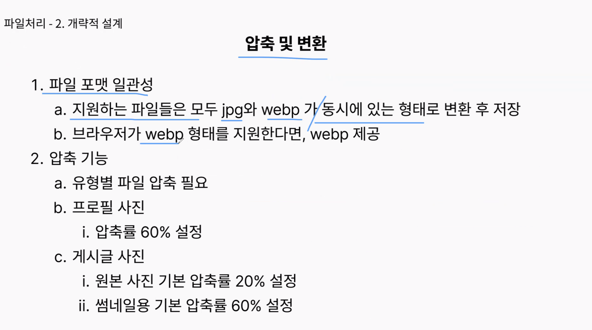

## 스크럼

### 오늘 배울 내용

- 없음

### 복습 및 추가 학습

- 없음

### 과제

- 없음

## 새로 배운 내용

### 주제 1: 이미지 처리(파일)

- 
- 
- 
- 
- 
- 
- 
  - 현재 구조에서는 WS가 아닌 WAS에서 구현
- 
- 
- 
  - 외부 의존성이 가장 작은 것부터 구현하는 것이 편하다. 왜냐하면 컨트롤러부터 하면 주석이 너무 많음.
- 
- 
- 
- 
- 
- 
- 
- 
- 
- 
- 
- 
- 펜으로 설계하기
- 회사에서는 동작 안함. 시간이 오래 걸리므로 공부 할 때 가능
- 업계 표준 또는 파일 형식 마다 다르다.
- 
- 남들 다 하는 커뮤니티 도메인이 중요한 게 아니라 실무적인 깊은 고민이 중요한 것이다. 이런 것들은 다 외울 수 없다.
- 깊은 고민을 하지 못한 사람은 이력서에 내용을 작성할 때 단순히 '커뮤니티 개발'이라고 적을 수 밖에 없다. 진짜 고민을 한 사람은 '트랜잭션 특정 문제를 해결하기 위해 어떤 것을 사용해봤습니다' 등으로 작성한다. 면접관은 이런 고민을 담아야 우리가 유리한 방향으로 이야기 할 수 있다.
- 스트레스가 너무 심하면 장소를 분리하는 게 좋다. 특정 장소에서 열심히 진행하고, 집에 가서는 잘 쉬고, 일찍 자라.
- 

## 오늘의 도전 과제와 해결 방법

- 도전 과제 1: 도전 과제에 대한 설명 및 해결 방법

## 오늘의 회고

- 성공적인 점, 개선해야 할 점, 새롭게 시도하고 싶은 방법 등을 포함할 수 있습니다.
- 매주 생기는 새로운 것들, 과제들을 적당히 자르고 넘어가야 한다.
- 적당히 한 줄 정리하고 넘어가야 한다.
- 너무 생각만 하면 부채만 쌓인다.
- 과제 수행 자체가 어려우면 찾아가야 한다.
- 옆에 있는 사람도 다 똑같다. 다른 사람들이 엄청난 차이가 있어보이지만 사실 크게 다르지 않다.

## 참고 자료 및 링크

- [링크 제목](URL)
