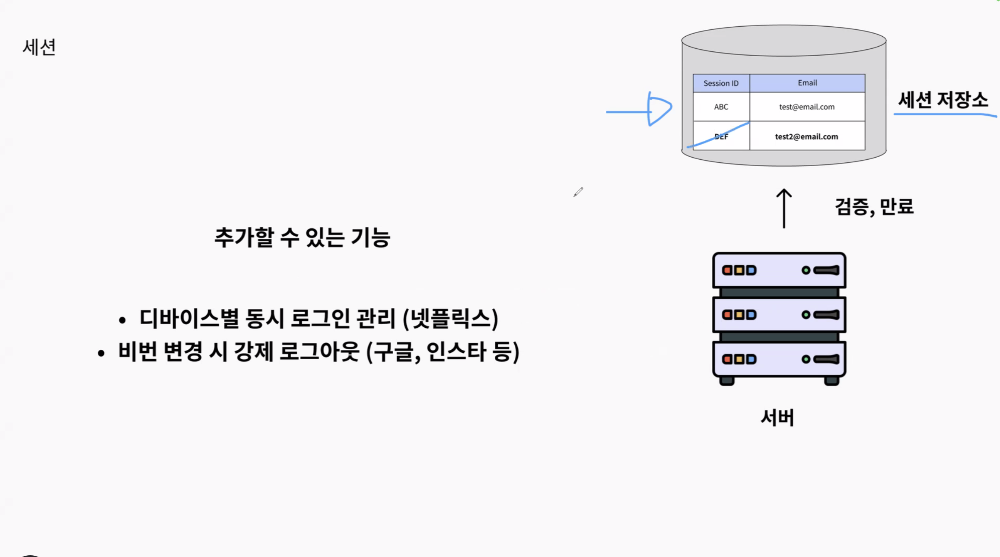
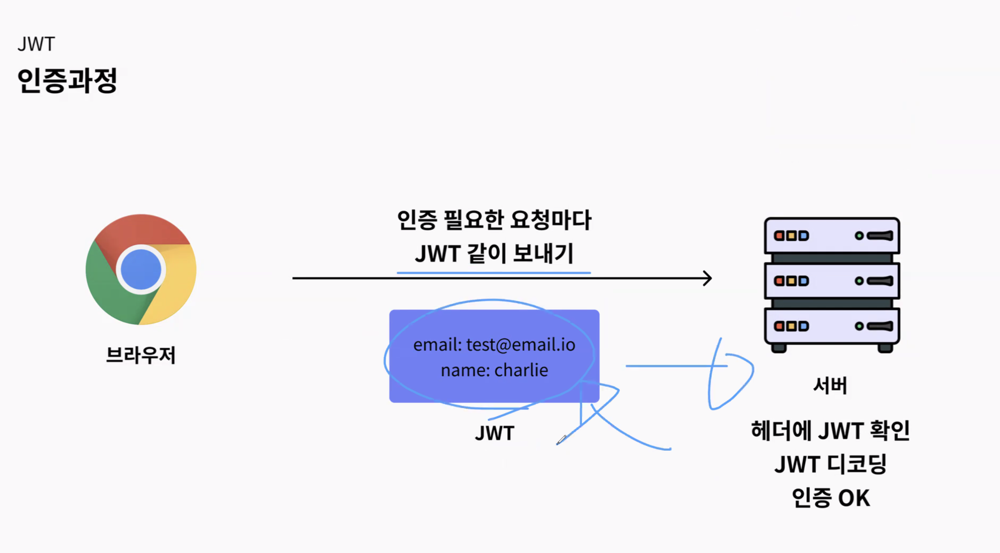
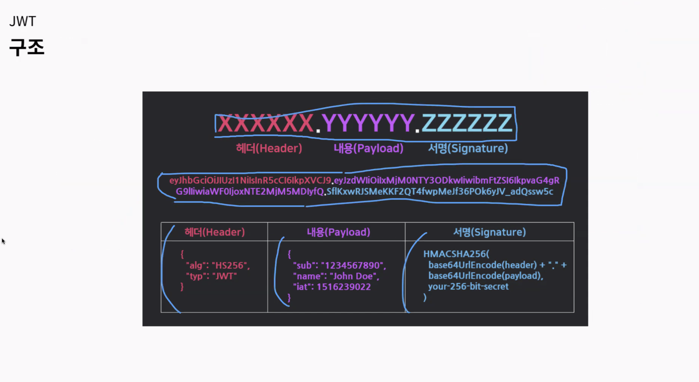
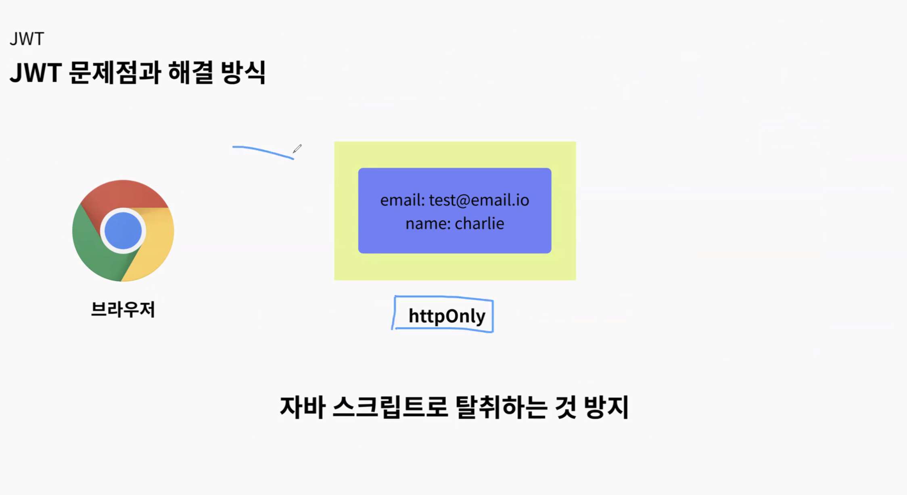
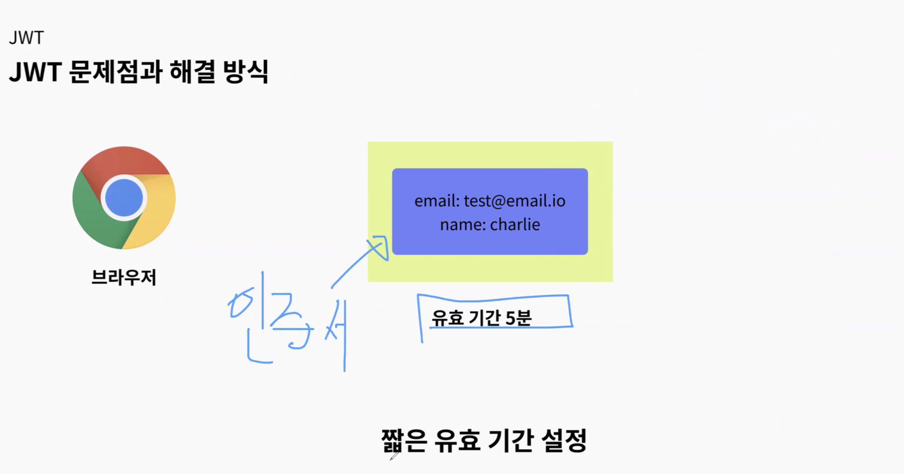
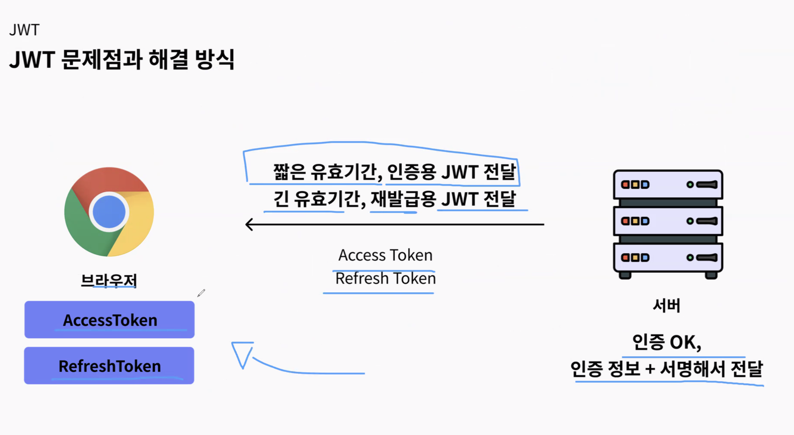

## 스크럼
### 오늘 배울 내용
*월
- HTTP Stateless
- 쿠키와 세션
- JWT 인증
- 직렬화

### 복습 또는 심화학습
- 없음

### 과제
Backend API 구현
- 게시글 CRUD
- 게시글 목록 조회
- 댓글 CUD
- 댓글 목록 조회

## 새로 배운 내용

### 주제 1: jwt

- jwt



- 헤더, 페이로드, 서명 세 가지 부분으로 나누어져 있음
- 클레임이라고 하는 이유는 JWT 자체가 클 보안적인 부분에서 
- 토큰 탈취 시 유효 기간 내에서는 대응 불가능

- 탈취를 조금 더 어렵게 하는 수준일 뿐. 안전하지 않다.


- Black list로 관리하며 로그아웃한 JWT 등을 저장 가능
세션은 서버에서 관리하는 세션 스토리지의 sid를 통해 인증

- 토큰은 클라이언트가 관리하는 스토리지에 갖고 있고, 서버가 갖고 있는 key 값으로 서명을 비교하며 위조 되었는지 확인 가능하다.
- 액세스 토큰이 탈취 당하면 리프레시 토큰도 탈취 가능한 거 아니냐? 막는 방법은?
    - access token은 매 요청 마다 담겨 있고, refresh token은 401을 받았을 때 액세스 토큰 업데이트 요청을 할 때만 있다.
    - Cookie option
        - secure: HTTPS인 상황에서만 가능
        - httpOnly: javascript가 해당 부분 접근 불가능
    - refresh rotation
### jwt 응용
```
- HttpOnly 는 JS 에서 접근 못하게 하는거고,
Secure 는 HTTPS 요청일 때만 쿠키를 전송하게 하는겁니다.

암호화된 통신을 할 때만 쿠키가 전송되도록 하는거에요

- 이거는 우리가 어떻게 보안을 구축할거냐에 따라서 케이스가 여러가지가 있는데,

리프레시 토큰을 어디에 저장할거냐에 따른 차이 라고 보시면 됩니다.

결론적으로 “쿠키는 항상 전송되지 않는다. 조건이 맞을 때 전송된다” 입니다.

말씀대로 만약에 우리가 클라이언트 쿠키에 리프레시 토큰을 저장했다면, HTTPS 요청 시에 쿠키 값에 있는 모든 값이 전달되기 때문에 
Refresh token 도 같이 전달되는 거라서 그렇게된다면 모든 요청에 리프레시 토큰이 포함된 그러니까 쿠키에 있는 값들이 전부 전달되는 형태가 될 수 있습니다.

여기에서 한 가지 추가로, 이제 credential 에 대해서 이야기가 나오는데, 

AccessToken 은 쿠키가 아닌 요청 헤더에 설정하게 됩니다. 

그 말은 모든 요청에서 엑세스 토큰을 사용할 때, 쿠키를 포함할거냐 말거냐를 선택해서 보낼 수 있습니다.

모든 요청에 해당 도메인에서 만든 쿠키 값을 항상 포함하게 되면, 불필요한 오버헤드가 생기고, 그래서 쿠키에 보관하고 있는, 리프레시 API 에서만 credential: true 로 쿠키에 있는 리프레시 토큰을 보내는 것이 일반적입니다.

- 예를 들어 대부분의 요청에서는 인증 헤더에 Access 토큰으로 인증 정보를 보내고, 리프레시 토큰이 보관 되어있는 쿠키를 붙이지 않습니다.

그리고 토큰을 재발급 받아야하는 뭐 예를 들어

POSt /auth/refresh-token 이런 API 가 있다라고 할 때,
클라이언트에서는 엑세스 토큰으로 요청을 보내고, 401 로 인증이 실패했을 때, 저 API 에 요청을 보내고, 그 때만 withCredentails 를 true 로 변경해서 쿠키에 있는 값들을 전달하는 형식으로도 진행할 수 있습니다.

결국 리프레시 토큰이 더 안전한 이유인, 자주 전송하지 않는다 <- 라는 점이 이러한 구성 때문에 생기게 됩니다.

+ 추가로 
당연히 쿠키에 저장하는 리프레시 토큰의 안전성을 높이는 방식 중 하나인 

HttpOnly 로 스크립트에서 접근 못하게 하고, Secure 등의 설정도 도움을 주는 것은 맞습니다.


결국엔
말씀하신거처럼 구현 방식에 따라서..

1.Refresh Token 을 브라우저에 httpOnly + Secure 쿠키에 저장해서, 
HTTPS 요청마다 보내고, 보냈을 때, 엑세스 토큰이 만료될 때 바로 동일 요청 같이 온 Refresh Token 으로 엑세스 토큰 재발급 받아서 인증 다시 하고, 하는 식으로도 구현할 수 있고

2. Refresh Token 똑같이 쿠키에 저장 (HttpOnly + Secure),
대부분의 요청 Req 인증 헤더에 Access Token 만 담기 
이후 인증 정보 만료 응답에만 POST /auth/refresh-token 에 요청할 때만 withCredentials: true 로 쿠키에 있는 리프레시 토큰으로 재 인증 받기, 인증 받은 다음 다시 Access token 값을 인증 헤더에 추가하기

이렇게도 구현할 수 있습니다.

사실 httpOnly + Secure 만으로 리프레스 토큰이 모든 공격에서 안전하냐 라고 하면 아닐 수도 있어서, 제가 제시한거처럼 재인증 받을 때만 리프레시 토큰이 있는 쿠키를 넣어서 (credential 기본 값 omit 혹은 FE, BE 도메인이 다를 때) 재인증 받고 하는 방식으로도 구현이 가능합니다.

모든 요청에 리프레시 토큰이 포함된 쿠키를 항상 전부다 짊어지고 보낼 필요는 없습니다.

서버에서 리프레시 토큰을 저장하고, 엑세스가 만료 됐을 때만 리프레시 토큰을 요청하는 형식으로도 구현할 수 있습니다.


결국에 얼만큼 보안성을 챙길거냐.
얼마나 HTTP 요청을 무겁게 보낼거냐.

매번 HTTP 요청에 모든 쿠키를 다 짊어지고 다니게 할거냐
인증 실패할 때만 쿠키에 있는 리프레시 토큰 값을 짊어지게 할거냐

이렇게 구현에 차이를 둘 수 있습니다.

결론 : 리프레시 토큰의 안정성은 httpOnly + Secure 으로도 높일 수 있지만, 요청마다 쿠키를 보낼거냐 말거냐로도 높일 수 있다.

Q) withCredentials 옵션은 CORS 인 backend 요청에만 의미가 있는거 아닌가요? 프론트엔드에 요청하면 여전히 쿠키를 같이 보내는거 아닌가요?

A) CORS 를 해결하기 위해서도 크리덴셜을 설정할 수 있고,

왜냐면 쿠키는 기본적으로 “동일한 도메인” 에서 자동으로 보내는게 규칙이여서, 백엔드가 다른 도메인일 때에도 쿠키 값을 가져다가 써야한다 라는 상황에서 credential 을 설정하는 경우도 많습니다.

동일한 도메인, 그러니까 자동으로 쿠키가 항상 붙어서 전달될 수 있도록 설정 되어 있는데.

프론트엔드에서 Fetch 호출할 때 동일한 도메인이여도 credentials 를 ‘omit’ 으로 설정하면 쿠키를 안보낼 수 있습니다.

결국 credential 은 이 요청에 도메인에 따라서 요청과 함께 쿠키를 보낼거냐, 아니면 도메인을 무시하고 쿠키를 함께 보낼거냐를 설정할 수 있고

그래서 엑세스 토큰과 리프레시 토큰을 사용할 때에 

엑세스 토큰은 SPA 같은 경우, 브라우저 메모리에서 들고 있고, 요청할 때마다 요청 인증 헤더에 설정하고 쿠키는 같이 보내지 않습니다.
이유는 쿠키 자체가 클 수도 있고, 리프레시 토큰 값을 굳이 같이 안보내도 되기 때문에..

그리고 만약에 인증이 실패했다. 다시 엑세스 토큰을 재발급 받아야해서, 쿠키 안에 있는 리프레시 토큰을 써야한다. 라고 할 때
POST /auth/refresh-token {
withCredentials: true } 으로 보내서,

평소에는 같이 첨부하지 않는 쿠키 값을 같이 보내서 재인증 받을 수 있습니다.

넴..
이게 인증 부분이 사실 얼만큼 보안성을 챙길거냐.
얼만큼 더 추가적인 개발을 할거냐에 트레이드 오프가 있어서 

프로젝트 레벨에서는 그냥 쿠키 전부다 보내는걸로 설정 많이 하는데, 제품 단계에서는 모든 Req 에 항상 쿠키값 전부다 보낸다고 하면 Req 요청 자체가 쿠키가 항상 포함되어서 커지기도 하고, 리프레시 토큰은 탈취 되었을 때 문제가 되니 굳이 보내려고는 하지 않습니다.

다만 이렇게 개발하려고 하면, 클라이언트나 서버에 로직이 복잡해지고, CORS 상황도 화이트 리스트를 잘 설정하거나, 도메인을 일치하게 해야합니다.

만약에 간단하게 프로젝트 구현한다 라고 하면, 그냥 모든 요청에 쿠키를 항상 포함하는 기본 설정으로 가셔도 좋고,

조금 더 보안을 챙겨야한다 라고 하면 쿠키는 항상 가는게 아닌 리프레시 토큰을 갱신할 때만 보내도록 설정할 수 도 있습니다!

약간 복잡한 이야기인데, 쿠키와 쿠키 설정에 따른 요청 등등..이야기해야하는 내용이 많아서 이 부분은 내일 수업으로 만들어서 전달 드려보도록 하겠습니다.

```

## 오늘의 도전 과제와 해결 방법

- 도전 과제 1: 도전 과제에 대한 설명 및 해결 방법

## 오늘의 회고

- 성공적인 점, 개선해야 할 점, 새롭게 시도하고 싶은 방법 등을 포함할 수 있습니다.

## 참고 자료 및 링크

- [링크 제목](URL)
