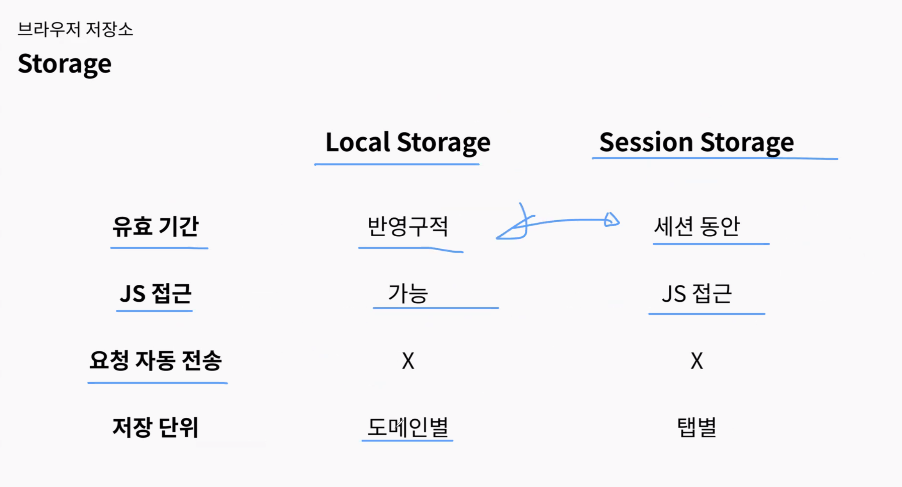
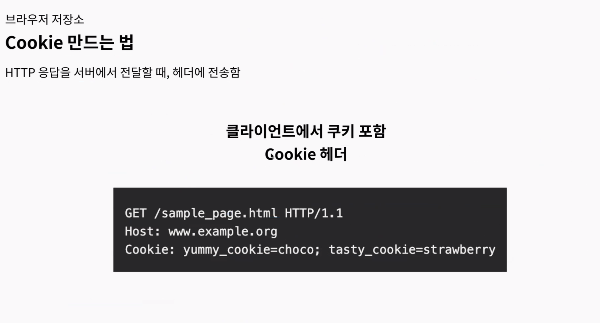
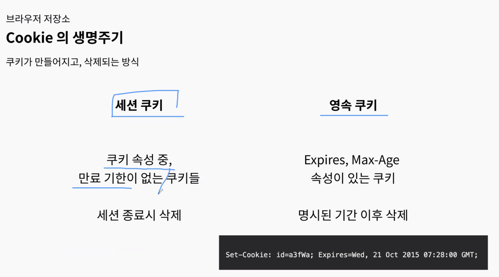
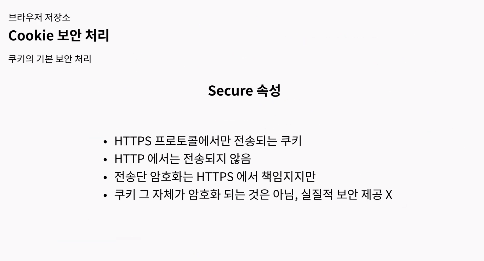
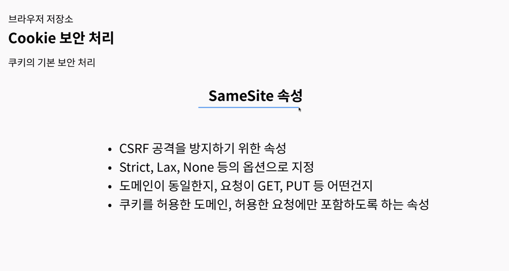
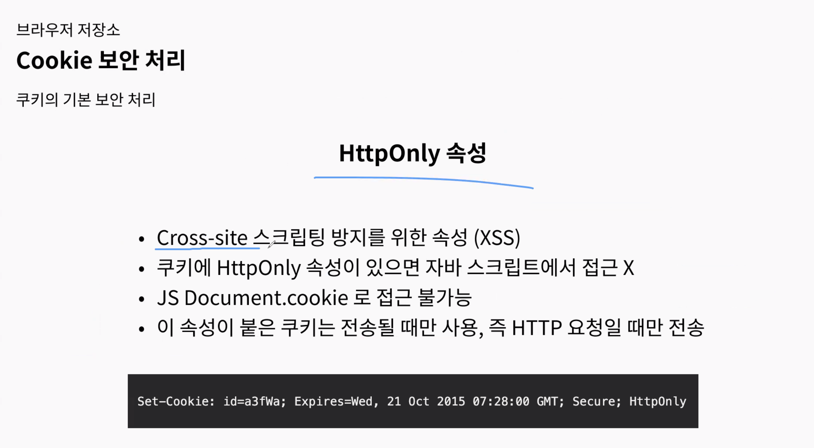
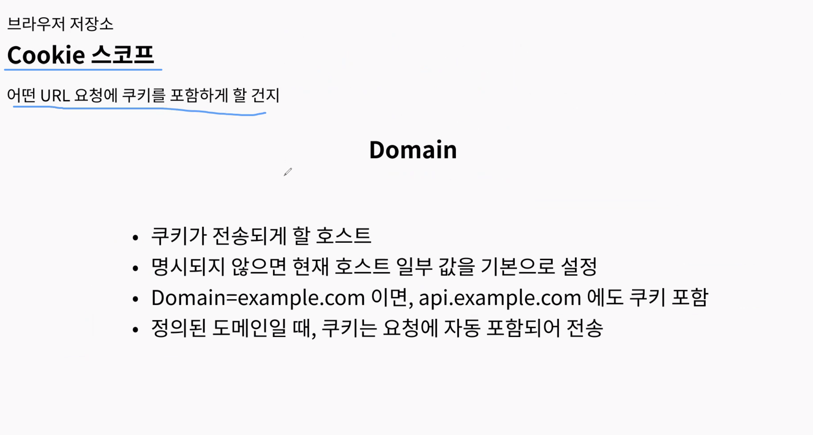
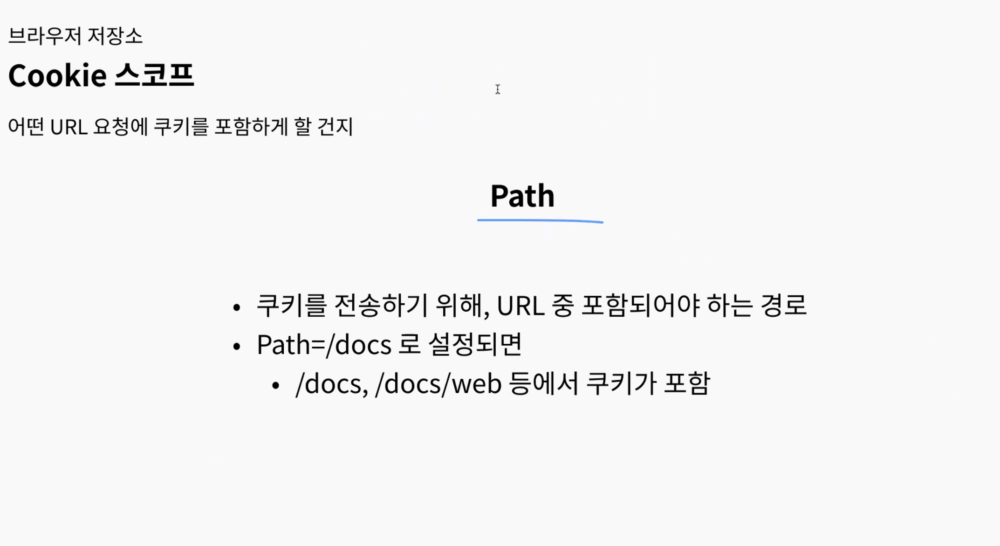
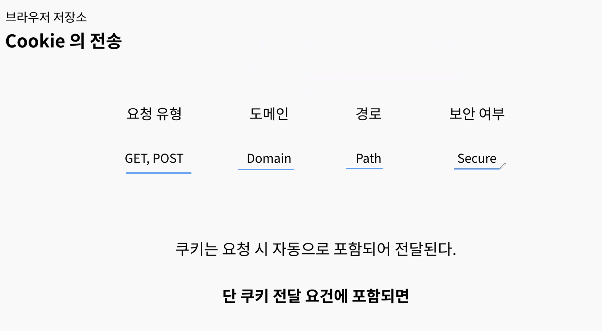

## 스크럼
### 오늘 배울 내용
*화
- HTTP Cookie 살펴보기
- 브라우저 저장소
- 자격 증명 헤더

### 복습 또는 심화학습
- 자격 증명 헤더 Authorization과 OAuth2.0, 현대의 AT, RT 저장 방식.
- 암호화, 해싱, 인코딩
- HTTPS 암호화 범위와 수명
- CSRF, MITM, XSS 공격과 쿠키와의 관계

### 과제
- 쿠키와 세션 이용하여 인가 방식 구현
    - 흐름 이해
- 사진 저장 방식 설계
- 401, 403 HTTP status code 구분

## 새로 배운 내용

### 주제 1: 브라우저의 저장소

- 
    - 도메인 당 (네이버, 구글) 로컬 스토리지가 존재합니다.
        - 스토리지는 기본적으로 도메인 별로 저장
    - 스토리지를 사용하는 것은 데이터를 안전하게 저장하고 사용하기 위해
    - 세션 스토리지도 도메인 별 저장하며, 탭 단위로 저장한다.(도메인 + 탭)
- 
- 
    - 쿠키가 만들어지고 삭제되는 방식의 차이
- 
- 
    - CSRF 공격 방지 용도: 브라우저가 자동으로 쿠키를 보내는 방식을 이용한 해킹 방식
- 
- 
    - 지정하지 않으면 현재 호스트 일부 값을 기본으로 지정
- 
    - 쿠키를 전송하기 위해 무조건 포함 되어야 하는 path. 
    - /path 일 때만 전송해야 하는 쿠키, /path2에만 전송해야 하는 쿠키를 나눈다.
- 
    - 쿠키는 서버에서 발급하여 브라우저에서 저장하고, 발급 범위에 따라(요청 유형, 도메인, 경로, 보안여부)

### AT 저장 심화
- AT는 보통 JS 인메모리에 저장

### RT 중앙 집중식 관리를 한다면 어떻게 하는지 찾아보기
- 공부!
- 예상 되는 문제 생각해보기

## 오늘의 도전 과제와 해결 방법

- 도전 과제 1: CSRF는 무엇이고, SameSite는 무엇인가 파헤치기.
```
## Lax의 안전한 GET요청이란?
허용되는 GET 요청의 예:

    <a> 태그를 사용한 링크 클릭

    브라우저 주소창에 직접 URL을 입력하는 경우

    자바스크립트의 window.location.replace() 등 페이지를 통째로 이동시키는 경우

허용되지 않는 GET 요청의 예:

    , <script> 태그를 통한 리소스 요청

    <iframe>으로 페이지를 불러오는 경우

    fetch, axios, XMLHttpRequest(AJAX)를 통한 API 요청
```

### 인코딩, 암호화, 해싱

- 인코딩은 알고리즘만 알면 복호화가 가능하다. 때문에 보안적인 데이터에 사용하지 않는다. 통신에서 통일된 형식을 사용하거나 매우 큰 용량의 파일, 이미지 등을 주고 받을 때 사용한다.
- 암호화는 키를 통해 데이터를 암호화 하는 것이다. 대표적으로 대칭 암호화, 비대칭 암호화가 있다. 이 둘의 차이는 암호화를 했던 키로 복호화를 할 수 있느냐 없느냐의 차이이다. 비대칭 암호화는 공개키와 비밀키를 생성하고, 보통 공개키를 유저에게 주고, 비밀키를 서버에서 갖는다. 유저가 공개키로 암호화 한 데이터를 서버에게 주면 이는 중간에 MITM 공격이 있어도 비밀키가 공개되지 않는 이상 복호화 할 수 없다. 즉, 서버만 이를 복호화 할 수 있다.
- 해싱: 복호화가 불가능하며, 특정 해싱 알고리즘을 사용하여 같은 입력값을 주면 항상 같은 출력값을 갖는다. 때문에 보안이 중요하지만 원본이 서비스에서 필요하지 않고, 단순 비교만을 할 수 있는 비밀번호 관리 등에서 사용한다.

## 오늘의 회고

- 성공적인 점, 개선해야 할 점, 새롭게 시도하고 싶은 방법 등을 포함할 수 있습니다.

## 참고 자료 및 링크

- [링크 제목](URL)
