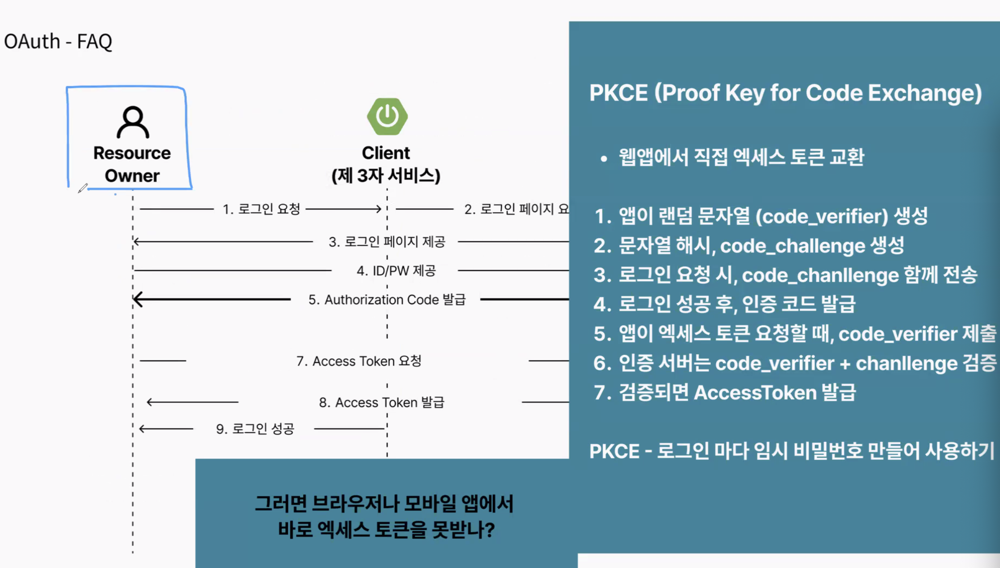

## 스크럼
### 오늘 배울 내용
- OAuth
- XSS, CSRF, CORS

### 복습 또는 심화학습
- OAuth의 Authorization code를 주는 방식에 대한 고찰
- 기능에 대한 각각의 Session의 의미와 책임 분리 및 신용
- SOP와 CORS

### 과제
쿠키와 세션 이용하여 인가 방식 구현 마무리

1. 로그인 성공 시 기존 세션 쿠키 삭제하고, 새로운 세션 생성하여 쿠키 보내기
2. HttpSession, Spring Session, 직접 세션 구현 선택
  - JWT로 마이그레이션 할 예정이므로 의존성이 큰 방식 보다 직접 구현하는 방향으로 갈 예정.
3. 요청 마다 인증 정보 확인하는 필터 인터페이스 작성 및 쿠키 파싱해서 세션 유효한지 확인하는 필터 구현
4. 필터 등록
5. Dispatcher servlet 이외에 발생하는 예외를 처리하는 필터 구현
6. 가장 상위에 예외처리 필터 등록
7. 중복 코드 줄이기 위한 커스텀 어노테이션 구현
8. 권한 확인이 필요한 핸들러에 어노테이션 적용

## 새로 배운 내용

### 주제 1: OAuth

- 리소스 오너가 클라이언트(제 3자 서비스)에서 리소스 서버에 있는 리소스를 사용하기 위한 방법
- 
- 
- 
- 
    - 유저는 제 3자 서비스인 우리 서비스가 아닌 리소스를 요청하려는 리소스 주인(카카오)에게 인증을 하고 인증정보를 받아 우리 서버에게 준다.
    - 우리 서버는 인증 정를를 통해 인가를 통하여 리소스 서버에게 리소스를 요청한다.
- 
- 
    - 6번에서 Authorization server가 Authorization code를 발급하여 리소스 오너에게 준다. 이때 GET 파라미터로 요청하게 되는데 이는 액세스 로그 등에 남겨지게 된다. 그런데 왜 코드만 리소스 오너에게만 주는가? 우리 서버에서는 해당 코드를 통해 서버의 리다이렉션 URL, secret code, Authorization code를 통해 
    - 9, 10번 과정이 필요한가? 액세스 토큰을 발급 받고 바로 리소스 오너에게 로그인 성공을 띄워주면 될 것이라 생각 했는데
- 
- 
- Q. OAuth가 필요한 이유?
    - 클라이언트(제 3자 서비스)에서 리소스 서버의 리소스를 사용하고, 이를 리소스 오너에게 제공하려 한다. 
    이때 리소스 오너가 리소스를 요청하는 과정에서 유저는 리소스 서버에게서 인증 및 권한 확인을 받아야 한다. 
    그러나 인증 책임을 클라이언트가 다루면 주요 도메인이 아닌 보안 관련 개발에 들어가는 자원이 늘어나고, 리소스 서버에서도 이를 전부 검증하는 것이 여간 힘든 것이 아니다. 
    때문에 인증은 클라이언트가 아닌 리소스 오너(User agent)와 Authorization server 사이에서 알아서 마무리 하고, 인증을 증명하는 Authorization code를 리소스 오너가 받아 code와 함께 클라이언트의 엔드포인트인 Redirect URI로 리다이렉트 된다. 
    클라이언트는 Authorization code를 통해 Access token을 발급 받고, 이를 통해 Resource server에 접근하여 리소스를 요청한다. 
- Q. Authorization code를 User agent가 응답 받는 이유?
    - 인증 책임을 User agent인 브라우저와 Authorization server가 들고 있으니 응답을 받으면 브라우저가 받는 형식이 자연스럽다. User agent가 받지 않고, 클라이언트인 우리 서버가 code를 받으면 Authorization server는 User agent인 리소스가 가야 할 목적지를 기억해서 넘겨줘야 한다. 여기에서는 클라이언트가 결국 우리 서버이고, 리소스 오너가 여기에서는 클라이언트가 될 것인데 반대의 상황으로 서버가 클라이언트에게게 청을 보내는 격이 되어 버린다. 
- 

## 오늘의 도전 과제와 해결 방법

- 도전 과제 1: 도전 과제에 대한 설명 및 해결 방법

## 오늘의 회고

- 성공적인 점, 개선해야 할 점, 새롭게 시도하고 싶은 방법 등을 포함할 수 있습니다.

## 참고 자료 및 링크

- [링크 제목](URL)
