## 스크럼
### 오늘 배울 내용
- 인터셉터와 필터

### 복습 또는 심화학습
- 없음

### 과제
- 쿠키와 세션 이용하여 인가 방식 구현
  - 과정 설계하기
- 이미지 관련 API(pre-signed URL 조회, 이미지 수정) 구현 완료

## 새로 배운 내용

### 주제 1: Filter and Interceptor

- 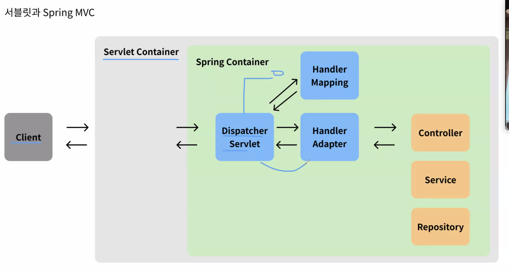
- 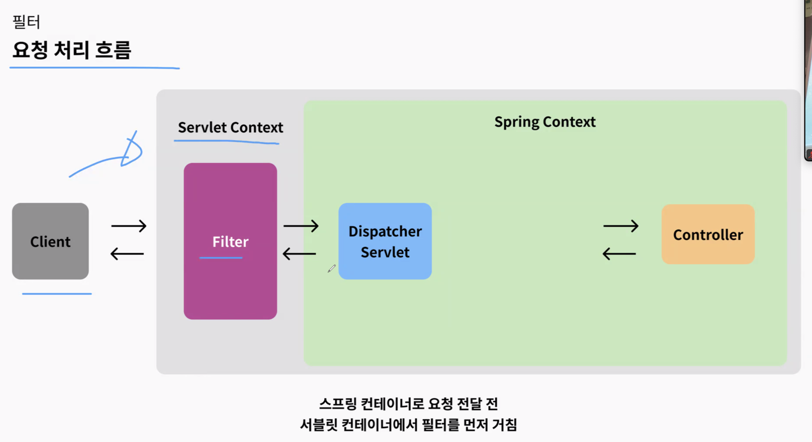
- 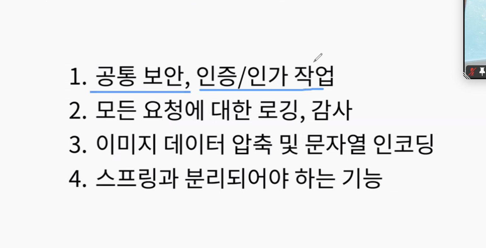
- 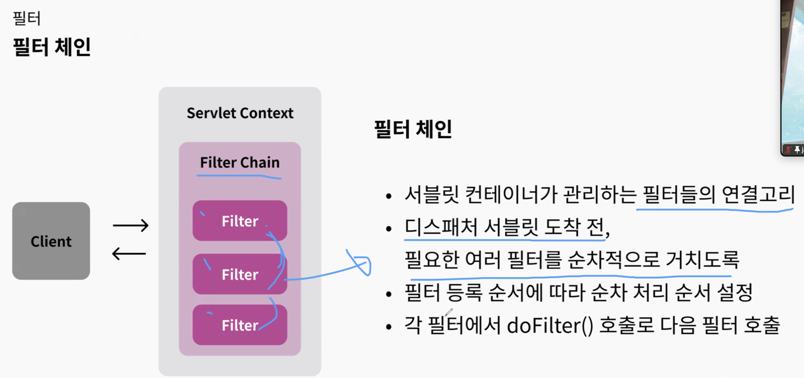
    - Context와 Container의 차이
- 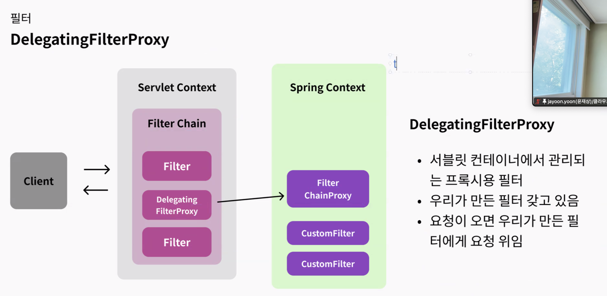
    - 일반적인 서블릿 필터는 DI를 사용할 수 없음.
    - 그러나 deleteingProxyFilter를 사용하면 DI가 가능.
- 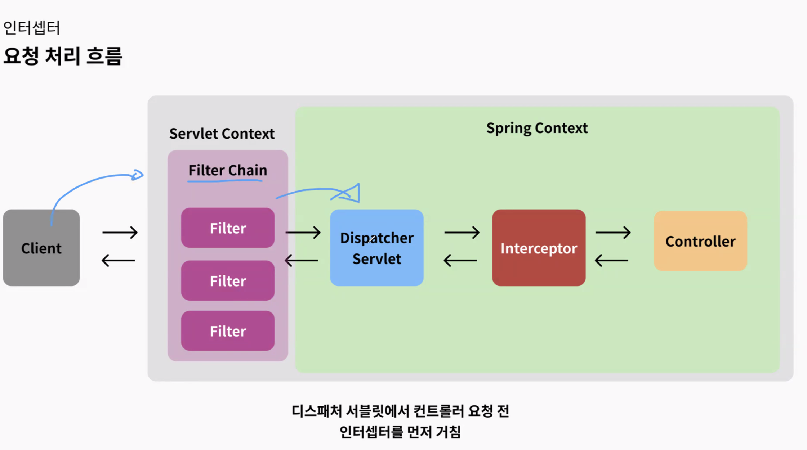
- 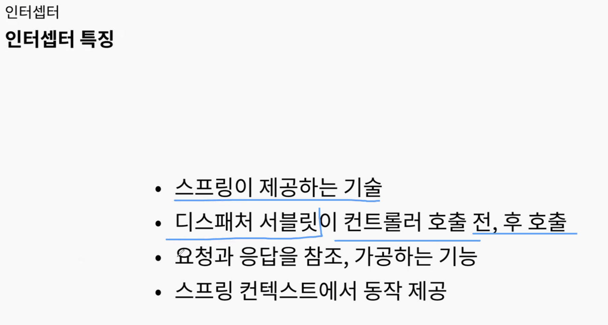
    -  filter와 다르게 스프링 내에서 호출된다.
    - tomcat이 해야 하는 역할은 interceptor에서 하지 못한다. 정적 컨텐츠는 filter에서 다루기.
- 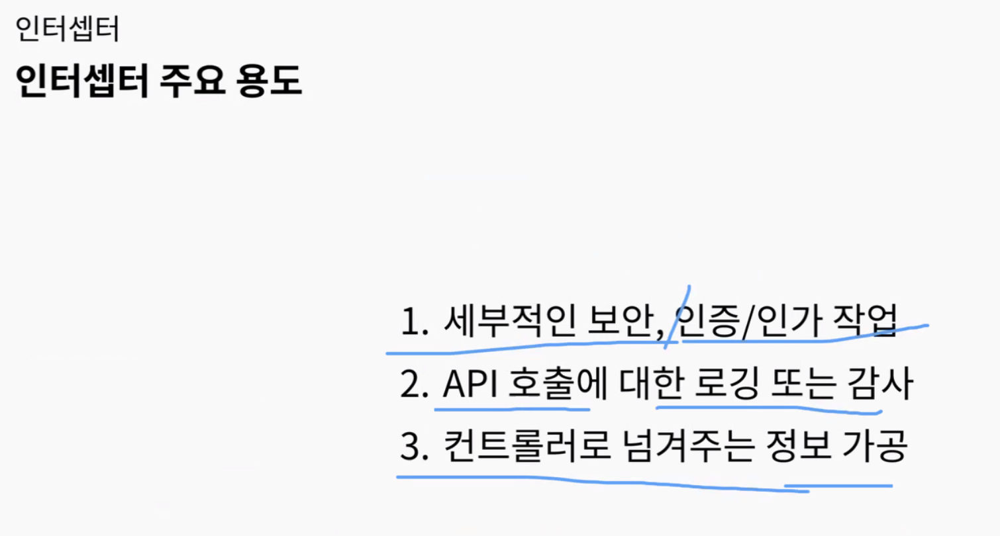
    - prehandle: 컨트롤러에 들어가기 전 작업,
    - posthandle: 컨트롤러 하위에서 발생하면 호출되지 않는다. dto 등을 사용하게되면서 요즘은 많이 사용하지 않는다. 
- 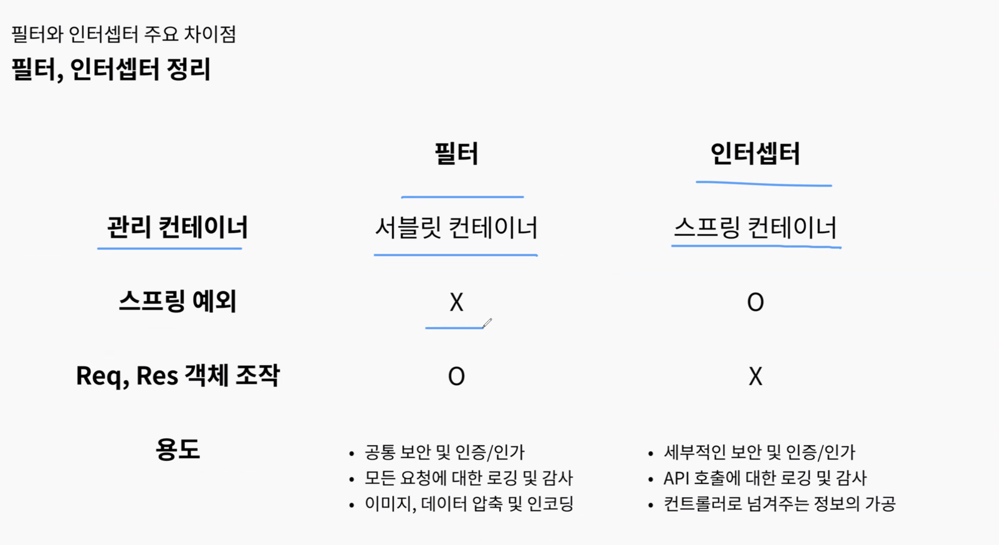
- 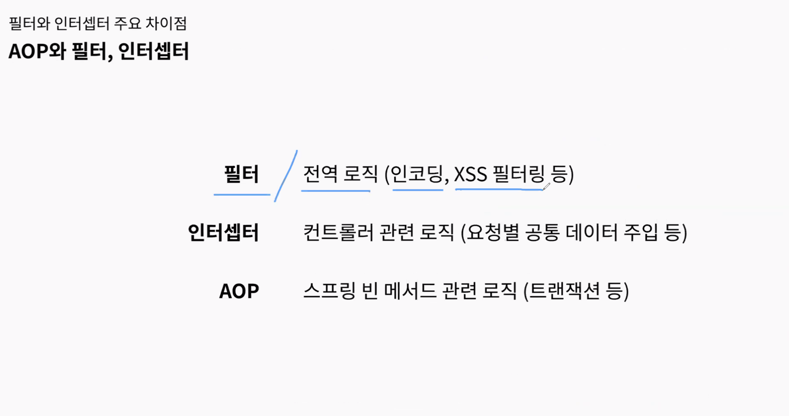
- filter, interceptor 구분
    - filter는 JWT 파싱
    - interceptor는 인가에서 권한 확인
    - 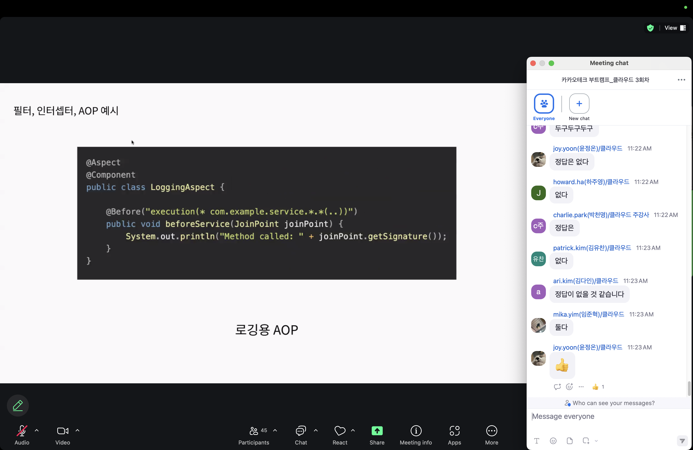
    - 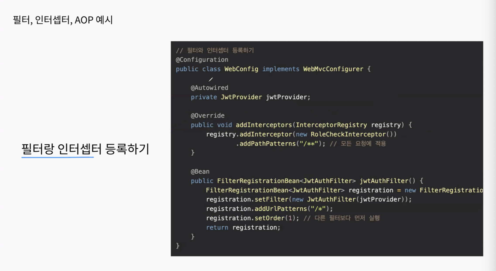
- [Dispatcher servlet's inerception](https://docs.spring.io/spring-framework/reference/web/webmvc/mvc-servlet/handlermapping-interceptor.html)에서 Warning 태그로 스프링은 보안 관련 작업을 인터셉터에서 진행하지 말고, Spring security나 filter에서 진행하라고 권고하고 있습니다. 이유는 컨트롤러가 사용하는 annotated path matching과 인터셉터가 사용하는 path matching이 다르기 때문입니다. 인터셉터는 경로에 대해 단순 문자열 비교를 하기 때문에 '/users/'와 같이 /로 끝나는 경로를 찾지 못할 수 있습니다. 때문에 보안적으로 필요한 리소스 요청이라면 이를 처리하지 못할 수 있겠죠. 때문에 인터셉터는 로깅과 같은 공통 관심사를 처리하도록 하고, 보안 관련 작업은 Dispatcher Servlet으로 가기 전에 모두 처리하는 것을 권고합니다.

## 오늘의 도전 과제와 해결 방법

- 도전 과제 1: 도전 과제에 대한 설명 및 해결 방법

## 오늘의 회고

- 성공적인 점, 개선해야 할 점, 새롭게 시도하고 싶은 방법 등을 포함할 수 있습니다.

## 참고 자료 및 링크

- [링크 제목](URL)
